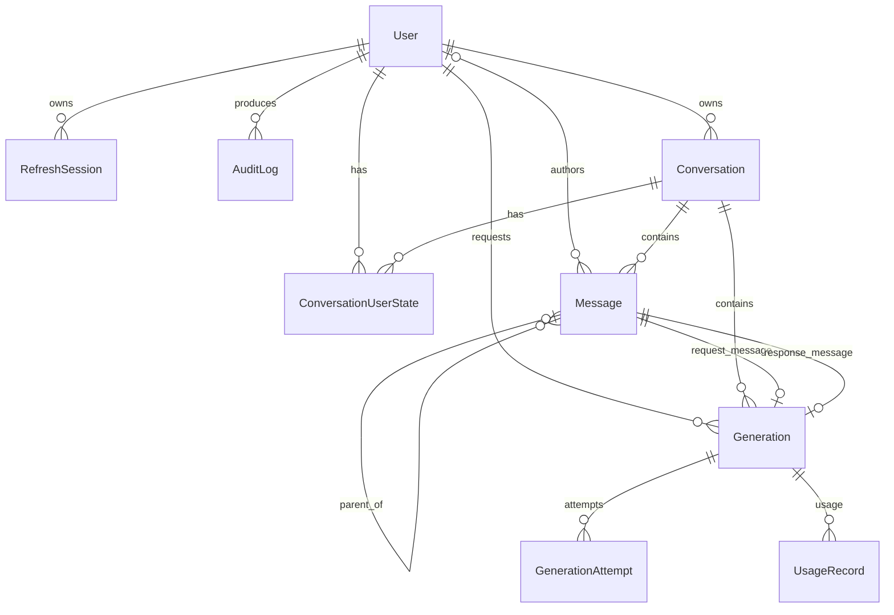
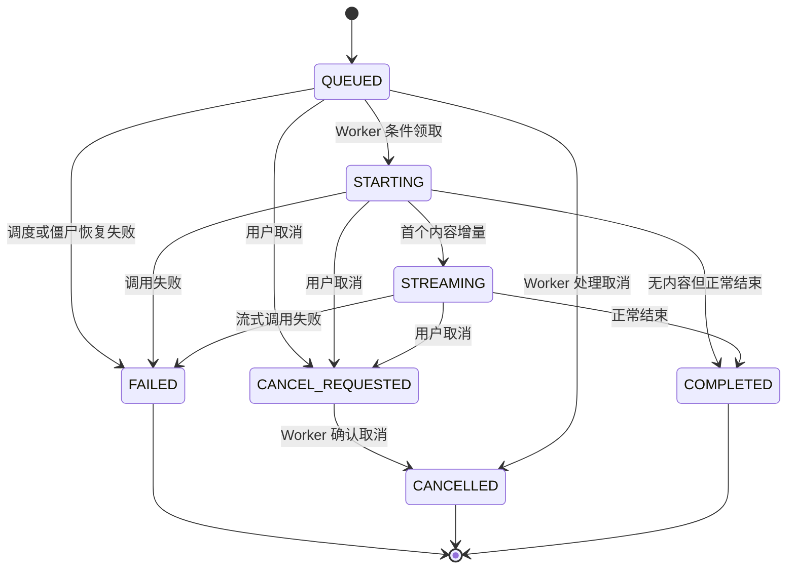
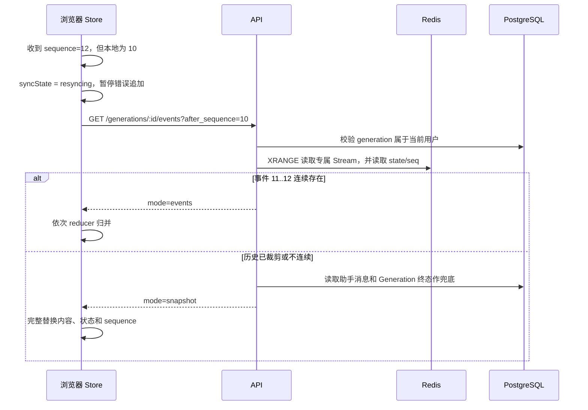

# 后端数据库与前端关键数据结构详解

本文以当前仓库代码为准，解释 PostgreSQL/Prisma 数据模型、后端传输契约、Redis 实时事件结构，以及 Web 端的服务端缓存与流式状态投影。它面向需要理解、维护或扩展本项目的开发者。

> 权威定义分别位于 `packages/database/prisma/schema.prisma`、`packages/contracts/src/index.ts`、`apps/web/src/lib/generation-store.ts`。迁移文件是数据库实际演进记录，Prisma Schema 是当前期望结构。

## 1. 数据分层与各自职责

项目不是把所有数据都放进一种存储，而是按生命周期分为四层：

| 层                 | 技术                     | 保存内容                                             | 是否为长期真相源  |
| ------------------ | ------------------------ | ---------------------------------------------------- | ----------------- |
| 持久业务数据       | PostgreSQL + Prisma      | 用户、会话、消息、生成任务、尝试、用量、审计、Outbox | 是                |
| 实时事件与临时快照 | Redis Streams / String   | 生成增量、用户级事件流、sequence、恢复快照           | 否，有保留期      |
| 服务端数据缓存     | TanStack Query           | 当前用户、对话列表/详情、分页消息                    | 否，可从 API 重取 |
| 浏览器实时投影     | Zustand + sessionStorage | 活动生成内容、草稿、SSE 连接状态、事件游标           | 否，可同步恢复    |

核心原则是：PostgreSQL 保存最终一致的业务状态；Redis 负责低延迟传输和短期恢复；前端本地状态负责即时渲染。流式内容结束后，前端会重新获取数据库中的消息，使临时投影收敛到持久化结果。

## 2. PostgreSQL 总体关系



`OutboxEvent` 没有数据库外键连接 `Generation`。它通过 `aggregateType = generation` 与 `aggregateId = generation.id` 建立逻辑关联，这是为了让 Outbox 保持通用事件表结构。永久删除对话时，服务层会显式删除相关 generation 的 Outbox，随后再利用级联外键删除对话树。

## 3. 枚举与状态机

### 3.1 用户与审计枚举

- `UserStatus`：`ACTIVE`、`DISABLED`。对外的 `UserResponse` 目前只允许返回 `ACTIVE`。
- `AuditOutcome`：`SUCCEEDED`、`FAILED`。
- `AuditAction`：注册、登录成功/失败、刷新会话、撤销会话、拒绝会话和永久删除对话等安全事件。

### 3.2 消息角色与状态

- `MessageRole`：`USER`、`ASSISTANT`、`SYSTEM`。
- `MessageStatus`：`PENDING` → `STREAMING` → `COMPLETED`，失败和取消分别进入 `FAILED`、`CANCELLED`。

用户输入创建后通常立即为 `COMPLETED`；对应的助手消息先以空内容和 `PENDING` 状态创建。Worker 收到首个增量后将其改为 `STREAMING`，最后把完整内容与终态写入数据库。

### 3.3 Generation 状态



活动状态集合为 `QUEUED`、`STARTING`、`STREAMING`、`CANCEL_REQUESTED`。`CANCEL_REQUESTED` 是请求态，不等于任务已经停止；只有 `CANCELLED` 才是终态。重试不会复用原 Generation，而是创建新的请求消息、响应消息和 Generation，原记录保留用于追踪。

`GenerationAttemptStatus` 则描述一次 Worker/供应商调用尝试：`STARTED`、`COMPLETED`、`FAILED`、`CANCELLED`。一个 Generation 可以有多次 Attempt。

## 4. 数据表逐项解释

### 4.1 `users`：用户主体

| 字段                        | 类型/约束        | 含义                                                  |
| --------------------------- | ---------------- | ----------------------------------------------------- |
| `id`                        | UUID，主键       | 用户稳定标识                                          |
| `email`                     | `CITEXT`，唯一   | 大小写不敏感邮箱；请求边界还会 trim、转小写并校验格式 |
| `password_hash`             | Text             | 密码哈希，绝不保存明文                                |
| `status`                    | `UserStatus`     | 账户状态，默认 `ACTIVE`                               |
| `created_at` / `updated_at` | `TIMESTAMPTZ(3)` | 创建和更新时间                                        |

`CITEXT` 扩展从数据库层阻止仅大小写不同的重复邮箱。删除用户会级联删除会话、用户状态、Generation 和刷新会话；消息作者采用 `SET NULL`，便于在其他保留场景中消除作者关联。

### 4.2 `refresh_sessions`：刷新令牌轮换链

| 字段              | 类型/约束          | 含义                                            |
| ----------------- | ------------------ | ----------------------------------------------- |
| `id`              | UUID，主键         | 会话标识                                        |
| `user_id`         | UUID，外键         | 所属用户                                        |
| `token_hash`      | `CHAR(64)`，唯一   | 刷新令牌的 SHA-256 类固定长度摘要，不保存原令牌 |
| `user_agent_hash` | `CHAR(64)`，可空   | User-Agent 摘要，用于安全判断                   |
| `expires_at`      | 时间               | 过期时间                                        |
| `revoked_at`      | 时间，可空         | 非空表示已撤销                                  |
| `rotated_from_id` | UUID，自关联且唯一 | 指向被当前会话替换的上一刷新会话                |
| `created_at`      | 时间               | 创建时间                                        |

`rotated_from_id` 的唯一约束使一个旧会话最多派生一个新会话，可用于识别令牌重复使用。索引 `(user_id, revoked_at, expires_at)` 支持按用户查找有效会话。

刷新令牌一旦被轮换就不能再次使用。系统检测到旧令牌重放时，会沿 `rotated_from_id` 递归撤销它已经派生出的全部后代，避免攻击者继续使用重放前窃取的新令牌。

### 4.3 `audit_logs`：安全审计记录

| 字段                 | 含义                                         |
| -------------------- | -------------------------------------------- |
| `user_id`            | 可空；未知用户的失败登录仍可审计             |
| `action` / `outcome` | 发生的安全动作及成功/失败结果                |
| `request_id`         | 串联 HTTP 请求和日志的安全标识               |
| `subject_id`         | 被操作对象，例如被永久删除的 conversation ID |
| `ip_hash`            | IP 摘要，不记录原始 IP                       |
| `created_at`         | 事件时间                                     |

按 `(user_id, created_at DESC)` 与 `(action, created_at DESC)` 建索引，分别支持用户调查和动作类型调查。删除用户时审计记录保留，但 `user_id` 置空。

### 4.4 `conversations`：对话业务主体

| 字段                        | 类型/约束      | 含义                                     |
| --------------------------- | -------------- | ---------------------------------------- |
| `id`                        | UUID，主键     | 对话标识                                 |
| `owner_user_id`             | UUID，外键     | 所有者；所有查询必须用认证用户限定       |
| `title`                     | `VARCHAR(120)` | 对话标题                                 |
| `last_message_at`           | 时间，可空     | 最后一条消息业务时间，用于展示和排序语义 |
| `created_at` / `updated_at` | 时间           | 生命周期时间                             |

索引 `(owner_user_id, updated_at DESC, id DESC)` 适合获取用户对话列表并以 ID 稳定打破相同时间。`last_message_at` 与 `updated_at` 不同：前者表达内容活跃时间，后者会因重命名等元数据操作变化；前端展示时间优先取前者。

### 4.5 `conversation_user_states`：用户视角的对话状态

复合主键为 `(conversation_id, user_id)`。

| 字段                        | 含义                                                       |
| --------------------------- | ---------------------------------------------------------- |
| `archived_at`               | 是否归档及归档时间；归档不是删除                           |
| `last_read_at`              | 最近标记已读时间                                           |
| `scroll_offset`             | 用户上次阅读位置，限制在 0～10,000,000                     |
| `has_unread`                | Worker 生成终态结果后设为 `true`，进入对话并标记已读后清除 |
| `created_at` / `updated_at` | 用户状态记录时间                                           |

把这些字段从 `conversations` 拆出，即使当前产品是一对话一所有者，数据模型仍清晰区分“共享业务实体”和“某个用户的阅读/归档视角”。索引 `(user_id, archived_at, updated_at DESC)` 支持活动与归档列表。

永久删除有两项服务层保护：对话必须先归档，且不能存在活动 Generation。删除 `conversation` 后，消息、Generation、Attempt、Usage 和用户状态依靠级联外键清理。

### 4.6 `messages`：可持久化消息

| 字段                        | 类型/约束          | 含义                                                      |
| --------------------------- | ------------------ | --------------------------------------------------------- |
| `id`                        | UUID，主键         | 消息标识；用户消息可使用客户端生成的 UUID                 |
| `conversation_id`           | UUID，外键         | 所属对话                                                  |
| `author_user_id`            | UUID，可空         | 用户消息作者；助手和系统消息通常为空                      |
| `role`                      | `MessageRole`      | 消息角色                                                  |
| `status`                    | `MessageStatus`    | 消息生成状态                                              |
| `content`                   | Text               | 面向用户的正文；流式期间保存 checkpoint，终态保存完整内容 |
| `reasoning_content`         | Text，可空         | 模型 reasoning 内容，与普通正文分离                       |
| `parent_message_id`         | UUID，自关联，可空 | 消息分支/父子关系的扩展基础；删除父消息时置空             |
| `created_at` / `updated_at` | 时间               | 生命周期时间                                              |
| `completed_at`              | 时间，可空         | 进入终态的时间                                            |

索引 `(conversation_id, created_at DESC, id DESC)` 与消息游标完全匹配。分页游标是 `{ id, createdAt }` 的 Base64URL JSON；下一页条件为“时间更早，或时间相同且 ID 更小”，比 offset 分页更能抵抗新消息插入。

### 4.7 `generations`：一次逻辑生成任务

| 字段组   | 字段                                                                  | 作用                                                     |
| -------- | --------------------------------------------------------------------- | -------------------------------------------------------- |
| 归属     | `user_id`, `conversation_id`                                          | 安全作用域与对话归属                                     |
| 消息映射 | `request_message_id`, `response_message_id`                           | 一对一连接用户请求消息和助手响应消息，二者均唯一         |
| 供应商   | `provider`, `model`, `provider_request_id`                            | 实际调用来源及供应商请求追踪                             |
| 状态     | `status`, `finish_reason`, `error_code`, `error_detail_safe`          | 任务状态、停止原因和可安全返回的错误信息                 |
| 顺序恢复 | `last_sequence`, `checkpoint_sequence`                                | 已发布的最大事件序号与已持久化快照序号                   |
| 幂等     | `idempotency_key`, `request_hash`                                     | 同用户请求去重，并检查同键是否被不同请求体复用           |
| 写入租约 | `writer_token`, `writer_heartbeat_at`                                 | 标识当前 Worker 写入者及心跳，用于防止双写和恢复僵尸任务 |
| 时间点   | `cancel_requested_at`, `started_at`, `first_token_at`, `completed_at` | 取消、启动、首 Token、终态时间，可用于性能分析           |
| 通用时间 | `created_at`, `updated_at`                                            | 记录创建和更新                                           |

关键约束与索引：

- `(user_id, idempotency_key)` 唯一：相同用户的创建请求可安全重放。
- `request_message_id`、`response_message_id` 各自唯一：一条消息不会被两个 Generation 占用。
- `(user_id, status, created_at)`：用户活动任务计数与列表。
- `(conversation_id, created_at)`：对话内任务查询。
- `(status, writer_heartbeat_at)`：僵尸 Generation 扫描。

`last_sequence` 是业务事件序号，不是 Redis Stream ID。它在单个 Generation 内从 1 单调递增。`checkpoint_sequence` 表示消息正文已经持久化到哪个序号；两者分离使 Worker 可以批量 checkpoint，避免每个 token 都写 PostgreSQL。

### 4.8 `generation_attempts`：执行尝试

每次调用尝试记录 `attempt_no`、状态、供应商请求 ID、写入者 Token、起止时间、是否收到首个增量、HTTP 状态与安全错误码。唯一约束 `(generation_id, attempt_no)` 保证尝试编号不重复。

它与 Generation 的区别是：Generation 表示用户看到的一次逻辑任务，Attempt 表示系统为完成该任务进行的一次物理执行。重试机制和故障分析因此不会覆盖历史证据。

### 4.9 `usage_records`：模型用量事实

一条记录关联一个 Generation，保存 provider/model，以及 prompt、completion、total、reasoning、cache hit、cache miss token。字段可空是因为不同 OpenAI-compatible 供应商返回的用量明细不完全一致。允许一对多可以保留多次上报或尝试的用量事实，而不是把可变供应商结构塞进 Generation 主表。

### 4.10 `outbox_events`：可靠异步交付意图

| 字段                              | 含义                                            |
| --------------------------------- | ----------------------------------------------- |
| `aggregate_type` / `aggregate_id` | 逻辑聚合类型与 ID；当前为 generation            |
| `type`                            | `generation.enqueue` 或生成完成、失败、取消终态 |
| `payload`                         | JSONB；入队载荷或带权威终态快照的版本化事件     |
| `published_at`                    | 空表示尚未成功投递 BullMQ 或 Redis Stream       |
| `attempts` / `last_error`         | 投递次数与安全错误码                            |
| `next_attempt_at`                 | 指数退避后的下次可领取时间                      |
| `locked_at` / `lock_token`        | 短期领取租约，允许崩溃后由其他 Relay 接管       |
| `dead_lettered_at`                | 非空表示非法载荷或超过重试上限，等待人工处理    |
| `created_at`                      | 创建时间及投递顺序依据                          |

消息、Generation 和入队 Outbox 在同一 PostgreSQL 事务创建，避免“业务提交了但队列任务丢失”。Worker 也在提交消息、Generation、Attempt、Usage 和未读状态的同一事务中创建终态 Outbox，消除“数据库已完成但浏览器永远收不到终态”的崩溃窗口。

Relay 用 `FOR UPDATE SKIP LOCKED` 短事务领取记录，释放事务后才访问 Redis/BullMQ，最后用另一个短事务确认。入队以 `generationId` 作为 BullMQ `jobId` 去重，终态以 Outbox ID 作为稳定 `eventId` 去重。失败记录退避重试；非法或超限记录进入死信且不自动删除。热路径索引只覆盖尚未发布、未死信且到达重试时间的记录。

## 5. 数据库级与服务层不变量

数据库外键和唯一约束不能表达全部业务规则，因此需要两层共同保证：

1. 所有对话、消息、Generation、事件历史和用量查询都必须以认证 `userId` 限定；不能信任浏览器传入用户 ID。
2. 创建 Generation 时用用户级 PostgreSQL advisory transaction lock 串行计算活动任务数，防止并发请求突破用户上限。
3. `Idempotency-Key` 相同且 `requestHash` 相同返回已有结果；键相同但请求不同则冲突。
4. 取消使用带允许源状态的条件更新，防止终态被回写为取消请求态。
5. Worker 通过 `writerToken` 和 heartbeat 取得唯一写入权；旧 Worker 丢失所有权后不能继续提交。
6. 归档只修改用户状态；永久删除需要“已归档且无活动任务”，并写审计日志。
7. 自动化测试使用假供应商，不真实调用 DeepSeek 或 OpenAI。

## 6. 后端传输契约

`packages/contracts` 使用 Zod 同时提供运行时校验和 TypeScript 推导类型。数据库模型不会直接暴露给 Web，避免传输层依赖 Prisma 类型，也避免泄露密码哈希、内部 writer token 或不安全错误细节。

### 6.1 主要响应结构

```ts
interface ConversationResponse {
  id: string;
  title: string;
  archivedAt: string | null;
  lastReadAt: string | null;
  scrollOffset: number;
  hasUnread: boolean;
  lastMessageAt: string | null;
  createdAt: string;
  updatedAt: string;
}

interface MessageResponse {
  id: string;
  conversationId: string;
  role: 'USER' | 'ASSISTANT' | 'SYSTEM';
  status: 'PENDING' | 'STREAMING' | 'COMPLETED' | 'FAILED' | 'CANCELLED';
  content: string;
  reasoningContent: string | null;
  completedAt: string | null;
  createdAt: string;
}
```

所有时间在 HTTP 边界转换为 ISO 8601 字符串。数据库中的 `authorUserId`、`parentMessageId`、`updatedAt` 等字段没有进入当前 `MessageResponse`，因为当前页面渲染不需要它们。

消息分页响应为：

```ts
interface MessagePageResponse {
  items: MessageResponse[]; // 数据库按 createdAt/id 降序返回
  nextCursor: string | null;
}
```

前端将多个降序页展开后整体 `reverse()`，得到聊天界面需要的时间正序。

### 6.2 创建 Generation 的命令与响应

请求体包含 `content` 和客户端生成的 `clientMessageId`，请求头另带 `Idempotency-Key`。浏览器对同一逻辑操作的网络重试复用这两个 ID。新对话首问使用 `POST /conversations/with-generation`，在一个事务中同时创建对话、用户状态、两条消息、Generation 和 Outbox，因此失败不会留下孤立空对话。成功响应同时返回：

- `{ id }` 形式的 conversation 摘要；
- 已落库的用户消息；
- 空的助手占位消息；
- `QUEUED` Generation。

`GenerationResponse` 对外提供任务 ID、两条消息 ID、provider/model、状态、`lastSequence`、完成/错误信息和各关键时间点，但不暴露 `requestHash`、`idempotencyKey`、`writerToken`、heartbeat 或 checkpoint。

### 6.3 统一错误结构

```ts
interface ErrorResponse {
  code: string;
  message: string;
  requestId: string;
  details?: unknown;
}
```

前端 `ApiClientError` 只保存 HTTP status、业务 code 和安全 message。非 GET 请求自动从 `chat_csrf` Cookie 读取值并写入 `x-csrf-token`；遇到非认证接口的 401 时最多刷新一次会话再重放原请求。

## 7. Redis 实时数据结构

生产环境将 BullMQ 放在 Queue Redis，将认证限流、SSE 租约和事件放在 Control/Event Redis；本地和测试可以指向同一实例。当前不采用 Redis Cluster。键名仍保留用户花括号命名，使同一用户的数据边界直观，并为 Lua 多键原子操作保持一致布局：

```text
{prefix}:{userId}:gen:{generationId}:seq       单 Generation 递增序号
{prefix}:{userId}:gen:{generationId}:state     最新完整快照 JSON
{prefix}:{userId}:gen:{generationId}           Generation 专属 Stream
{prefix}:{userId}:user                         用户级复用 Stream
{prefix}:{userId}:event-dedupe:{eventId}       发布幂等结果
```

Lua 脚本原子完成 `INCR sequence`、写快照、写 Generation Stream、写用户 Stream、裁剪用户历史、设置 TTL 和事件去重。因此同一个逻辑事件在专属流与用户流中共享相同 `sequence`，但有不同用途：

- Generation Stream ID 是 `{sequence}-0`，用于按业务序号补拉缺失事件。
- 用户 Stream ID 由 Redis `XADD *` 生成，作为跨多个对话和任务的 SSE 游标。

### 7.1 用户事件信封 `UserEvent`

```ts
interface UserEvent {
  version: 1;
  eventId: string;
  streamId: string; // Redis 用户 Stream ID，例如 1720000000000-0
  type: GenerationEventType;
  conversationId: string;
  generationId: string;
  messageId: string;
  sequence: number; // 单个 Generation 内严格递增
  occurredAt: string;
  payload: Record<string, unknown>;
}
```

事件类型及前端含义：

| 事件                      | 主要 payload                                      | 前端动作                          |
| ------------------------- | ------------------------------------------------- | --------------------------------- |
| `generation.started`      | 启动信息                                          | 状态设为 `STARTING`               |
| `message.reasoning_delta` | `delta`                                           | 追加 reasoning                    |
| `message.delta`           | `delta`                                           | 追加普通正文并设为 `STREAMING`    |
| `message.snapshot`        | `content`, `reasoningContent`, `snapshotSequence` | 完整替换本地内容和序号            |
| `generation.usage`        | Token 用量                                        | 当前 reducer 不渲染，由后端持久化 |
| `generation.completed`    | 完成信息                                          | 设为 `COMPLETED` 并刷新权威缓存   |
| `generation.failed`       | `safeMessage` 等                                  | 设为 `FAILED`，保存可展示错误     |
| `generation.cancelled`    | 取消信息                                          | 设为 `CANCELLED`                  |

## 8. 前端关键数据结构

### 8.1 TanStack Query：可重新获取的服务端状态

Query Key 采用层级结构：

```ts
currentUser = ['current-user'];
conversations.all = ['conversations'];
conversations.list(archived) = ['conversations', 'list', { archived }];
conversations.detail(id) = ['conversations', 'detail', id];
conversations.messages(id) = ['conversations', 'messages', id];
```

这种前缀设计允许终态事件通过 `conversations.all` 一次失效活动列表、归档列表等所有对话查询，同时能只刷新特定对话的消息。

消息使用 `useInfiniteQuery`，每页 30 条，`nextCursor` 作为下一页参数。对话详情中的滚动位置采用乐观写入：先更新 Query Cache，再调用 API；请求失败且缓存仍保持该次值时才回滚，避免较新的滚动写入被旧请求覆盖。

### 8.2 Zustand：跨路由 Generation 实时投影

```ts
interface ActiveGenerationState {
  generationId: string;
  conversationId: string;
  messageId: string;
  status: GenerationStatus;
  content: string;
  reasoningContent: string;
  lastAppliedSequence: number;
  syncState: 'synced' | 'resyncing';
  error?: string;
  terminalAt?: number;
}

interface GenerationStore {
  connectionStatus: 'connecting' | 'connected' | 'disconnected';
  generations: Record<string, ActiveGenerationState>;
  drafts: Record<string, string>; // key 为 conversationId
}
```

`generations` 必须以 `generationId` 为键，而不是以 conversation 或 message 为键，因为同一对话允许同时存在多个任务。每个状态仍保存 `conversationId` 供页面投影、`messageId` 供覆盖助手占位消息。

`drafts` 按 `conversationId` 隔离，切换路由不会丢失其他对话的输入。Store 挂在聊天布局上方的 `GenerationManager` 配合使用，因此 SSE 与生成状态不会因单个对话页面卸载而清空。

### 8.3 事件 reducer 的幂等和缺口规则

`reduceGenerationEvent` 是纯函数式归并核心：

```text
event.sequence <= lastAppliedSequence      duplicate，忽略
event.sequence == lastAppliedSequence + 1  applied，按类型归并
event.sequence >  lastAppliedSequence + 1  gap，标记 resyncing
```

Delta 只能追加到连续状态；Snapshot 则完整替换正文和 reasoning。这个规则防止 SSE 重连时重复内容，也防止漏事件后继续追加导致回答永久损坏。

`register` 同样拒绝较旧初始状态覆盖较新的本地状态；`replaceSnapshot` 拒绝序号倒退。活动任务不因时间被清理；终态对象最多保留 30 分钟和最近 100 条，避免长时间打开页面后浏览器状态无限增长。

### 8.4 服务端消息与实时 Overlay 的合并

`ConversationView` 先取得数据库消息页，再按 `messageId` 查找实时 Generation：

```text
PostgreSQL MessageResponse
        +
Zustand ActiveGenerationState（同 messageId）
        ↓
渲染消息：实时 content/reasoning/status 覆盖数据库占位或 checkpoint
```

这样不会在消息列表旁额外渲染一条临时回答，也不需要把每个 token 写入 TanStack Query。收到 `completed`、`failed` 或 `cancelled` 后，前端使消息和对话查询失效，重新读取数据库终态。

### 8.5 SSE 帧与游标

前端 `SseParser` 保留跨 HTTP chunk 的残片，以空行识别完整帧，并支持 `id`、`event` 和多行 `data`。网络 chunk 从来不被当作业务事件边界。

用户级 Redis Stream 游标保存在：

```text
sessionStorage['chat.eventCursor.{userId}']
```

它按用户隔离且只在当前浏览器标签生命周期内存在。首次连接先调用 `/sync`：API 先固定用户流尾游标，再读取所有活动 Generation 的 Redis/数据库快照。浏览器同时提交自己已知的活动 Generation ID；即使终态 Redis 事件曾丢失，API 也会返回 PostgreSQL 权威终态用于修复。前端注册或对账快照、保存游标后再建立 SSE，从而消除“同步完成到开流之间”的丢事件窗口。

断线使用指数退避加抖动重连，最大基础等待 15 秒。服务端还提供 heartbeat、每用户连接数限制、响应缓冲上限和 drain 超时；过慢客户端会被断开，再依靠游标恢复。

## 9. 缺口恢复与最终一致性



恢复结果必须追平触发缺口的实时事件，否则本次连接被视为失败并进入重连。Redis 快照存在时优先使用；TTL 到期后回退到 PostgreSQL 中的 checkpoint 或终态消息。因此 Redis 丢失会降低实时恢复粒度，但不应导致已 checkpoint 或已完成内容永久丢失。

## 10. 一次生成的数据生命周期

1. Web 生成 `clientMessageId` 和 `Idempotency-Key`，提交内容。
2. API 在一个事务中创建用户消息、空助手消息、`QUEUED` Generation 和 Outbox，并更新对话时间。
3. Outbox Dispatcher 将 `{ generationId }` 幂等投递 BullMQ。
4. Worker 条件领取任务，写 `writerToken`，创建 Attempt，并把 Generation 改为 `STARTING`。
5. Worker 调用标准化 LLM Adapter；增量经 Lua 原子写入 Redis sequence、快照和两个 Stream。
6. API 从用户级 Stream 读取事件并通过 SSE 转发；Web 按 Generation sequence 归并。
7. Worker 周期性把完整内容 checkpoint 到 `messages`，并推进 `checkpoint_sequence`。
8. 完成、失败或取消时，Worker 在数据库事务中写消息和 Generation 终态、Attempt、用量、未读状态及终态 Outbox。
9. Outbox Relay 用稳定事件 ID 将终态投递到 Redis；Web 刷新消息和对话缓存，实时投影收敛到 PostgreSQL。若事件暂未投递，后续 `/sync` 对账仍可修复终态。

## 11. 修改数据结构时的检查清单

新增或修改字段时，应同时检查：

1. `packages/database/prisma/schema.prisma` 与新的 Prisma migration，不能只改 Schema。
2. 是否需要索引、唯一约束、外键删除策略或现有数据回填。
3. `packages/contracts` 的请求/响应 Zod Schema，禁止直接向 Web 暴露 Prisma 类型。
4. API 的 `toConversation`、`toMessage`、`toGeneration` 等显式映射。
5. Web 的 Query Cache、Zustand reducer、overlay 合并和终态失效逻辑。
6. Redis 事件 `version`、payload 兼容性、快照恢复和 sequence 不变量。
7. 用户作用域、授权失败路径、幂等/并发条件与日志脱敏。
8. 行为变更的成功、失败和授权测试；阶段交付前执行根目录全量验证命令。

## 12. 关键源码索引

- 数据库当前模型：`packages/database/prisma/schema.prisma`
- 数据库迁移：`packages/database/prisma/migrations/`
- HTTP/SSE 共享契约：`packages/contracts/src/index.ts`
- 对话与消息持久化：`apps/api/src/conversations/conversations.service.ts`
- Generation 创建、取消与重试：`apps/api/src/generations/generations.service.ts`
- Outbox 投递：`apps/api/src/outbox/outbox-dispatcher.service.ts`
- SSE、同步和历史补偿：`apps/api/src/events/events.service.ts`
- Worker 状态推进与 checkpoint：`apps/worker/src/generation/generation.processor.ts`
- Redis 原子发布：`apps/worker/src/events/event-publisher.service.ts`
- 前端 API 边界：`apps/web/src/lib/chat-api.ts`、`apps/web/src/lib/api.ts`
- 前端实时状态：`apps/web/src/lib/generation-store.ts`
- 用户级实时连接：`apps/web/src/components/generation-manager.tsx`
- 消息与 overlay 合并：`apps/web/src/components/conversation-view.tsx`
