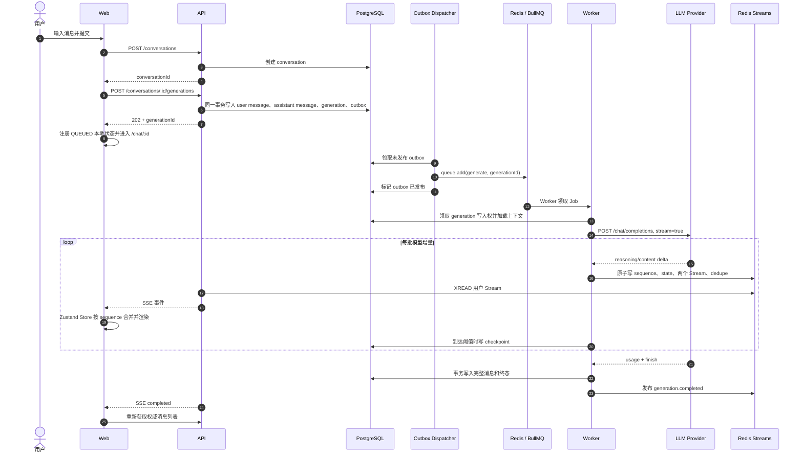

# 对话生成全链路与 Redis 数据说明

本文以一次本地真实生成任务为例，说明用户从 Web 页面输入第一条消息开始，数据如何依次经过 Web、API、PostgreSQL、Outbox、BullMQ、Worker、LLM、Redis Streams 和 SSE，最后回到浏览器并完成渲染。

示例数据采集于 2026-08-26，本地 Redis 地址为 `127.0.0.1:16379`：

- `conversationId`：`63769966-7b92-4965-a643-27327252b417`
- `generationId`：`18afab5c-9469-4b8f-acdb-f5bd0dc58872`
- `userId`：`e2ef97f0-11c2-4431-990d-83d6cf910122`
- 生成时间：2026-08-26 13:08:17 ～ 13:09:23 UTC
- 最终状态：`COMPLETED`
- 最终业务 sequence：`1277`

文中的消息内容和 reasoning 内容只统计长度，不展示原文。

## 1. 先理解三个不同的返回通道

一次生成看起来像一个连续动作，实际由三条通道共同完成：

1. 创建命令：浏览器通过普通 HTTP `POST` 提交消息，API 创建数据库记录后立即返回 `202 Accepted`。
2. 后台执行：Outbox Dispatcher 把任务放进 BullMQ，Worker 在原 HTTP 请求之外调用 LLM。
3. 实时结果：Worker 把增量事件写入 Redis，API 通过另一条用户级 SSE 长连接把事件推送给浏览器。

因此，`POST /generations` 的响应只表示任务已经可靠创建，不包含模型最终回答。即使用户切换路由或创建请求已经结束，Worker 仍会继续执行。



## 2. 第一阶段：用户输入与创建对话

### 2.1 首页提交

首次发言从 [`NewConversationStart`](../apps/web/src/components/new-conversation-start.tsx#L16) 开始。提交表单后，前端顺序执行：

```ts
const conversation = await createConversation(createTitle(message));
const result = await createGeneration(conversation.id, message);
```

这里不是一个接口，而是两个接口：

1. `POST /api/v1/conversations`：先创建空对话并取得 `conversationId`。
2. `POST /api/v1/conversations/:conversationId/generations`：创建用户消息和生成任务。

如果用户已经在某个对话页面内继续发送消息，则不再创建 conversation，直接从第二步开始。调用位置是 [`ConversationView`](../apps/web/src/components/conversation-view.tsx#L49)。

### 2.2 前端构造 generation 请求

[`createGeneration`](../apps/web/src/lib/chat-api.ts#L137) 会生成两个不同的 UUID：

- `Idempotency-Key` 请求头：保证同一个创建请求重试时不会产生两个 generation。
- `clientMessageId` 请求字段：作为用户消息 ID，防止同一条客户端消息被重复创建。

请求形态如下：

```http
POST /api/v1/conversations/{conversationId}/generations
Idempotency-Key: {random UUID}
Content-Type: application/json

{
  "content": "用户输入",
  "clientMessageId": "{random UUID}"
}
```

## 3. 第二阶段：API 创建任务，但不调用 LLM

### 3.1 Controller 接收与鉴权

请求由 [`GenerationsController.create`](../apps/api/src/generations/generations.controller.ts#L29) 接收。Controller 完成以下边界校验：

- 用户身份只取自认证后的 `request.auth.userId`。
- `conversationId` 必须是 UUID。
- `Idempotency-Key` 必须存在且长度合法。
- Body 通过 `createGenerationRequestSchema` 校验。

随后调用：

```ts
GenerationsService.create(userId, conversationId, idempotencyKey, body);
```

浏览器不能提交任意 `userId`，这保证后续对话、generation 和事件都按已认证用户限定作用域。

### 3.2 GenerationsService 的 PostgreSQL 事务

核心逻辑位于 [`GenerationsService.create`](../apps/api/src/generations/generations.service.ts#L42)。它先检查幂等键，然后在一个 PostgreSQL 事务中完成：

1. 获取用户级事务 advisory lock，串行化同一用户的并发创建。
2. 验证 conversation 存在并且 `ownerUserId` 等于当前用户。
3. 统计该用户的活动 generation，执行用户并发上限检查。
4. 创建 `USER / COMPLETED` 消息，内容为本次用户输入。
5. 创建空的 `ASSISTANT / PENDING` 消息，等待 Worker 填充。
6. 创建 `generation / QUEUED`，关联请求消息和响应消息。
7. 更新 conversation 的 `lastMessageAt`。
8. 创建 `generation.enqueue` Outbox 事件，payload 只有 `generationId`。

关键关系是：

```text
conversation
  ├── user message        已完成，保存用户输入
  ├── assistant message   PENDING，初始内容为空
  └── generation          QUEUED
        ├── requestMessageId  → user message
        └── responseMessageId → assistant message

outbox_event
  ├── type: generation.enqueue
  └── payload: { generationId }
```

消息、generation 和 Outbox 必须在同一个事务里提交。这样即使 API 在提交后立即崩溃，数据库中仍保留“这个任务需要入队”的可靠意图。

### 3.3 API 返回 202

事务提交后，API 返回：

- conversation 摘要；
- 已保存的 user message；
- 空的 assistant message；
- 状态为 `QUEUED` 的 generation。

前端收到响应后，将 generation 注册到全局 [`useGenerationStore`](../apps/web/src/lib/generation-store.ts#L133)，刷新 React Query 中的消息和对话数据，然后进入 `/chat/{conversationId}`。

此时模型可能还没有开始执行。页面显示的 `QUEUED` 只是浏览器对数据库任务状态的本地投影。

## 4. 第三阶段：Outbox 将 generation 投递到 BullMQ

[`OutboxDispatcherService`](../apps/api/src/outbox/outbox-dispatcher.service.ts#L24) 在 API 进程中按固定周期运行，但不属于用户的 HTTP 请求处理器。

每轮 dispatcher：

1. 查询 `published_at IS NULL` 的 `generation.enqueue` Outbox。
2. 使用 `FOR UPDATE SKIP LOCKED` 领取一批记录，允许多个 API 实例安全并行。
3. 校验 payload 中的 `generationId` 与 Outbox aggregate ID 一致。
4. 调用 BullMQ `queue.add('generate', { generationId })`。
5. 成功后设置 Outbox 的 `publishedAt`；失败则记录安全错误码，下一轮继续重试。

BullMQ 配置：

```ts
{
  jobId: generationId,
  attempts: 5,
  backoff: { type: 'exponential', delay: 500 },
  removeOnComplete: { count: 1000 },
  removeOnFail: { count: 1000 }
}
```

`generationId` 同时作为固定 `jobId`。即使 Outbox 因“队列写入成功、数据库标记前崩溃”而再次投递，BullMQ 也不会创建另一个不同 ID 的任务。

## 5. 第四阶段：Worker 领取任务并准备 LLM 上下文

### 5.1 BullMQ Worker 入口

[`GenerationWorkerService`](../apps/worker/src/generation/generation-worker.service.ts#L22) 是 BullMQ Consumer。它长期监听 `generation` 队列，拿到 Job 后只解析：

```json
{ "generationId": "..." }
```

然后调用：

```ts
GenerationProcessor.process(generationId);
```

供应商 API Key 不在队列里，也不会进入 Web 或 API。真正的 LLM 调用只发生在 `apps/worker`。

### 5.2 领取写入权

[`GenerationProcessor.process`](../apps/worker/src/generation/generation.processor.ts#L54) 首先：

1. 从 PostgreSQL 读取 generation。
2. 终态任务直接返回，避免重复执行。
3. 通过 Redis semaphore 获取全局、供应商和用户级并发许可。
4. 生成随机 `writerToken`。
5. 使用条件更新把 `QUEUED` 改为 `STARTING`，同时写入 `writerToken` 和 heartbeat。
6. 周期更新 heartbeat；一旦失去所有权，旧 Worker 停止发布。

BullMQ lock、固定 Job ID、数据库条件状态转换和 `writerToken` 共同防止两个 Worker 同时写同一个 generation。

### 5.3 加载上下文与 checkpoint

Worker 从 PostgreSQL 加载同一 conversation 内：

- 状态为 `COMPLETED` 的历史消息；
- 角色为 `SYSTEM`、`USER` 或 `ASSISTANT`；
- 排除本次仍为空的 response message。

随后根据模型上下文窗口和最大输出 Token 配置裁剪上下文。若 Worker 是重启或重试，还会读取 response message 中已经持久化的 `content`、`reasoningContent` 和 generation sequence，从 checkpoint 继续构造当前状态。

## 6. 第五阶段：Worker 调用 LLM

Worker 通过 `LLM_PROVIDER_ADAPTER` 依赖标准化接口，不直接耦合具体供应商。非测试环境由 [`ProviderModule`](../apps/worker/src/generation/provider.module.ts#L29) 创建 [`OpenAiCompatibleAdapter`](../packages/llm/src/openai-compatible-adapter.ts#L26)。

适配器向供应商发出：

```http
POST {LLM_BASE_URL}/chat/completions
Authorization: Bearer {仅存在于 Worker 的 API Key}
Content-Type: application/json

{
  "model": "...",
  "messages": [...],
  "stream": true,
  "stream_options": { "include_usage": true },
  "max_tokens": ...,
  "thinking": { "type": "enabled" }
}
```

适配器使用 `parseDataOnlySse` 解析供应商的流式响应，并归一化成四类内部事件：

- `reasoning_delta`：推理内容增量；
- `content_delta`：最终回答内容增量；
- `usage`：输入、输出等用量；
- `finish`：结束原因及可选的供应商 request ID。

从这一层开始，`GenerationProcessor` 不需要知道当前供应商返回 JSON 的专属字段格式。

## 7. 第六阶段：模型增量写到哪里

### 7.1 Worker 内存缓冲

[`GenerationProcessor.processOwned`](../apps/worker/src/generation/generation.processor.ts#L131) 使用 `for await` 消费标准化供应商事件：

- `content_delta` 追加到内存中的 `content`；
- `reasoning_delta` 追加到 `reasoningContent`；
- 收到首个 delta 时，把数据库 generation 和 assistant message 改为 `STREAMING`；
- `usage` 暂存在内存，结束时持久化；
- `finish` 保存结束原因。

微小 delta 不会必然逐 Token 发布。Worker 会按 `GENERATION_DELTA_MAX_CHARS` 或 `GENERATION_DELTA_FLUSH_MS` 合并后再调用 `publishEvent`，减少 Redis、SSE 和浏览器渲染次数。

### 7.2 Redis 原子发布

[`EventPublisherService`](../apps/worker/src/events/event-publisher.service.ts#L46) 使用一段 Lua 脚本原子完成：

1. 检查本次 `eventId` 是否已经发布。
2. `INCR` generation sequence。
3. `SET` generation 完整状态快照。
4. `XADD` generation 专属 Stream。
5. `XADD` 用户级 Stream。
6. 裁剪用户级 Stream 的过期历史。
7. 刷新 sequence、state 和两个 Stream 的 TTL。
8. 写入 event dedupe 结果。

一次逻辑事件因此在两个 Stream 中共享相同的 `eventId` 和业务 sequence，不会发生“快照已经更新，但事件未写入”这样的部分成功状态。

### 7.3 PostgreSQL checkpoint

Redis 用于低延迟事件传输，但不是最终事实来源。Worker 在满足任一条件时调用 `writeCheckpoint`：

- 距离上次 checkpoint 达到配置时间；
- 新增内容字符数达到配置阈值。

checkpoint 在一个 PostgreSQL 事务中条件推进：

- generation 的 `lastSequence` 和 `checkpointSequence`；
- assistant message 的当前 `content` 和 `reasoningContent`。

更新条件要求新 sequence 大于旧 `checkpointSequence`，防止迟到写入覆盖更新的内容。

## 8. 第七阶段：Redis 事件如何回到前端

### 8.1 根级 GenerationManager

[`GenerationManager`](../apps/web/src/components/generation-manager.tsx#L14) 挂载在根布局，而不是具体对话页面中。因此切换路由只改变当前渲染的对话，不会关闭后台 generation，也不会丢失其他对话的实时事件。

首次初始化时，它先调用：

```http
GET /api/v1/sync
```

API 的 [`EventsService.sync`](../apps/api/src/events/events.service.ts#L275) 先固定用户 Stream 的尾游标，再读取该用户所有活动 generation 的 Redis 快照；Redis 不存在时回退 PostgreSQL。返回内容包括：

- `eventCursor`：后续 SSE 从哪里继续；
- `activeGenerations`：活动任务的完整浏览器状态。

这个顺序避免“读取快照结束、SSE 开始之前恰好产生事件”导致的丢事件窗口。

### 8.2 用户级 SSE

同步完成后，浏览器调用：

```http
GET /api/v1/events?after={eventCursor}
Accept: text/event-stream
```

[`EventsService.stream`](../apps/api/src/events/events.service.ts#L47) 从认证上下文取得 `userId`，然后对该用户的 Redis Stream 执行阻塞式 `XREAD`。每条 Redis 事件被转换为 SSE frame：

```text
id: {Redis user Stream ID}
event: message.delta
data: {完整的标准化 UserEvent JSON}
```

浏览器持续读取 `response.body`，由 `SseParser` 拆分 frame，将最近的 SSE ID 保存到 `sessionStorage`。连接断开后使用指数退避重连，并从保存的游标继续读取。

这里不使用 Redis consumer group。每个浏览器标签页都有独立游标，都能获得同一用户的完整事件副本。

### 8.3 前端按 sequence 应用事件

[`reduceGenerationEvent`](../apps/web/src/lib/generation-store.ts#L35) 以 `generationId` 隔离不同任务，并根据业务 sequence 做三种判断：

- `sequence <= lastAppliedSequence`：重复事件，忽略；
- `sequence === lastAppliedSequence + 1`：正常应用；
- `sequence > lastAppliedSequence + 1`：发现缺口，暂停追加并进入 `resyncing`。

正常增量分别追加到：

- `state.content`；
- `state.reasoningContent`。

`ConversationView` 只选择当前 `conversationId` 的 generation 状态，与 PostgreSQL 消息列表合成页面显示，因此后台对话可以继续更新，但不会错误渲染到当前对话。

### 8.4 缺口恢复

发现 sequence 缺口时，浏览器调用：

```http
GET /api/v1/generations/{generationId}/events?after_sequence={lastAppliedSequence}
```

[`EventsService.history`](../apps/api/src/events/events.service.ts#L193) 先验证 generation 属于当前用户，然后同时读取：

- generation 专属 Stream；
- generation state；
- generation sequence。

如果 Stream 中的事件连续，API 返回 `mode: events`，前端依次补齐；如果事件已经过期或不连续，则返回 `mode: snapshot`：

1. 优先使用 Redis 完整 state；
2. Redis state 也过期时，使用 PostgreSQL assistant message；
3. sequence 使用 Redis sequence，不存在时使用数据库 `lastSequence`。

## 9. 第八阶段：生成完成

供应商流结束后，Worker 的顺序非常重要：

1. 刷新尚未发布的 delta。
2. 将 attempt 标记为 `COMPLETED`。
3. 如有 usage，发布 `generation.usage`。
4. 调用 `finalizeCompleted`，在 PostgreSQL 事务中保存完整 assistant message、generation 终态、usage 和未读状态。
5. 数据库提交成功后，才发布 Redis `generation.completed`。
6. 将最终 sequence 写回 PostgreSQL。

“先写最终数据库，再发 completed”保证前端收到 completed 后重新请求消息列表时，能够读到权威最终内容。

浏览器收到 `generation.completed` 后：

- Zustand 中把 generation 状态改为 `COMPLETED`；
- 失效当前 conversation 的消息查询；
- 失效对话列表查询；
- React Query 重新从 API 获取 PostgreSQL 中的最终消息。

实时 Store 负责生成过程中的低延迟显示，终态后重新读取数据库负责最终收敛。

## 10. 本次 generation 的 Redis 数据

采集时 Redis 中共有 1287 个 `chat:dev:*` 键：

| 类别                  | 数量 | 归属                   |
| --------------------- | ---: | ---------------------- |
| Generation 事件与快照 |    4 | 本次生成               |
| 事件发布去重键        | 1277 | 本次生成的 1277 个事件 |
| BullMQ 队列键         |    6 | 队列基础结构和本次 Job |
| 合计                  | 1287 | 与 Redis GUI 一致      |

### 10.1 Generation 专属 Stream

```text
chat:dev:evt:{e2ef97f0-11c2-4431-990d-83d6cf910122}:gen:18afab5c-9469-4b8f-acdb-f5bd0dc58872
```

- 类型：Stream
- 事件数：1277
- 内存：约 475 KiB
- TTL：采集时约 23.6 小时
- Stream ID：`1-0` ～ `1277-0`，直接使用业务 sequence

事件分布：

| 事件类型                  | 数量 |
| ------------------------- | ---: |
| `generation.started`      |    1 |
| `message.reasoning_delta` | 1175 |
| `message.delta`           |   99 |
| `generation.usage`        |    1 |
| `generation.completed`    |    1 |

它用于单个 generation 的精确补拉和缺口恢复。

### 10.2 Sequence

```text
chat:dev:evt:{e2ef97f0-11c2-4431-990d-83d6cf910122}:gen:18afab5c-9469-4b8f-acdb-f5bd0dc58872:seq
```

- 类型：String
- 当前值：`1277`
- 内存：125 B
- TTL：采集时约 23.6 小时

它是 generation 内的业务序号，用于增量幂等、缺口检测和 checkpoint 推进。

### 10.3 完整状态快照

```text
chat:dev:evt:{e2ef97f0-11c2-4431-990d-83d6cf910122}:gen:18afab5c-9469-4b8f-acdb-f5bd0dc58872:state
```

- 类型：String，内容为 JSON
- 内存：约 14 KiB
- TTL：采集时约 23.6 小时
- 状态：`COMPLETED`
- 最终正文长度：457 字符
- reasoning 内容长度：4016 字符

结构为：

```json
{
  "content": "...",
  "reasoningContent": "...",
  "status": "COMPLETED"
}
```

每次发布事件都会完整覆盖这个快照。它用于页面初始化以及 Stream 无法连续重放时的快速恢复。

### 10.4 用户级 Stream

```text
chat:dev:evt:{e2ef97f0-11c2-4431-990d-83d6cf910122}:user
```

- 类型：Stream
- 事件数：1277
- 内存：约 476 KiB
- TTL：采集时约 23.6 小时
- Stream ID：Redis 时间序列 ID

它与 generation Stream 保存同一批标准化事件，但用于把该用户所有 conversation 的事件汇总到一条 SSE 连接。事件中的 `conversationId` 和 `generationId` 供浏览器分发。

### 10.5 Event dedupe

格式：

```text
chat:dev:evt:event-dedupe:{eventId}
```

- 数量：1277，与本次 generation 的事件数相同；
- 类型：String；
- 每条从创建时保留 24 小时；
- Value：`[sequence, generationStreamId, userStreamId]`。

例如：

```json
[1, "1-0", "1787749697639-0"]
```

它解决 Redis 命令结果不确定的问题：如果 Redis 已执行 Lua，但 Worker 因连接中断没有收到返回值，重试时可通过相同 `eventId` 取得原发布结果，避免重复追加事件。

### 10.6 BullMQ Job Hash

```text
chat:dev:queue:generation:18afab5c-9469-4b8f-acdb-f5bd0dc58872
```

- 类型：Hash
- 大小：约 1 KiB
- Job payload 只有 `generationId`
- 最终状态：completed
- 不使用 TTL，通过 `removeOnComplete.count = 1000` 按数量清理

这里没有用户输入、完整上下文或供应商密钥。Worker 使用 generation ID 从 PostgreSQL 获取实际上下文。

### 10.7 BullMQ completed Sorted Set

```text
chat:dev:queue:generation:completed
```

- 类型：Sorted Set；
- member 是 generation ID；
- score 是完成时间的毫秒时间戳；
- 用于维护已完成 Job 的排序和按保留数量清理。

### 10.8 BullMQ Queue events Stream

```text
chat:dev:queue:generation:events
```

本次任务包含：

```text
added → waiting → active → completed → drained
```

这是 BullMQ 维护的队列生命周期事件。当前项目没有显式 `QueueEvents` 业务消费者，主要供 BullMQ 内部机制、诊断工具和 Redis GUI 使用。

### 10.9 BullMQ id、meta 和 stalled-check

```text
chat:dev:queue:generation:id
chat:dev:queue:generation:meta
chat:dev:queue:generation:stalled-check
```

- `id`：BullMQ 队列内部自增 ID；即使使用自定义 UUID Job ID，也会维护该计数器。
- `meta`：保存队列元数据，本次可见 `opts.maxLenEvents = 10000`。
- `stalled-check`：短 TTL 的内部互斥键，用于避免多个 Worker 同时执行 stalled Job 扫描；周期性过期和重建。

## 11. 数据所有权与生命周期

| 数据                              | 权威性         | 保存位置         | 生命周期                 | 主要用途                   |
| --------------------------------- | -------------- | ---------------- | ------------------------ | -------------------------- |
| conversation、message、generation | 最终事实来源   | PostgreSQL       | 持久保存                 | 历史查询、权限、终态恢复   |
| Outbox                            | 可靠投递意图   | PostgreSQL       | 发布后仍可审计           | 防止数据库与队列双写丢任务 |
| BullMQ Job                        | 执行调度状态   | Redis            | 按完成/失败数量保留      | Worker 调度、重试、锁      |
| generation Stream                 | 临时事件历史   | Redis            | 默认 24 小时             | 单任务精确补拉             |
| user Stream                       | 临时实时总线   | Redis            | 默认 24 小时并按时间裁剪 | 用户级 SSE 多路复用        |
| state + sequence                  | 临时活动快照   | Redis            | 默认 24 小时             | 快速同步和缺口恢复         |
| event-dedupe                      | 临时发布结果   | Redis            | 每条默认 24 小时         | Lua 发布重试去重           |
| Zustand generation state          | 页面实时投影   | 浏览器内存       | 当前页面会话             | 增量渲染                   |
| SSE cursor                        | 标签页续传游标 | `sessionStorage` | 当前标签页会话           | 断线续读用户 Stream        |

Redis 丢失会影响仍在活动窗口内的实时重放，但最终完成的回答仍保存在 PostgreSQL。Redis 事件超过保留窗口后，客户端仍可通过数据库快照恢复当前完整内容。

## 12. 本次数据的观察结论

本次生成约 950 KiB 的主要 Redis 占用来自两份事件 Stream，其中 generation Stream 和 user Stream 各保存一份标准化事件。1277 个事件中有 1175 个 `message.reasoning_delta`，约占 92%。

这是当前架构允许的结果，但也说明 reasoning 增量的发布粒度是影响 Redis 内存、SSE 帧数量和浏览器 reducer 次数的主要因素。如果后续需要优化，应优先观察并调整：

- `GENERATION_DELTA_MAX_CHARS`；
- `GENERATION_DELTA_FLUSH_MS`；
- 供应商 reasoning chunk 的实际大小和到达间隔；
- 更大批次对首屏响应延迟的影响。

增大批次可以减少 Redis 和前端压力，但会增加单次可见增量的等待时间，需要在实时感和系统开销之间权衡。

## 13. 最短调用路径索引

```text
NewConversationStart / ConversationView.submit
  → apps/web/src/lib/chat-api.ts:createGeneration
  → apps/api/src/generations/generations.controller.ts:create
  → apps/api/src/generations/generations.service.ts:create
  → PostgreSQL messages + generation + outbox_events
  → apps/api/src/outbox/outbox-dispatcher.service.ts:dispatchOnce
  → BullMQ generation queue
  → apps/worker/src/generation/generation-worker.service.ts
  → apps/worker/src/generation/generation.processor.ts:process/processOwned
  → packages/llm/src/openai-compatible-adapter.ts:streamChat
  → apps/worker/src/events/event-publisher.service.ts:publish
  → Redis generation Stream + user Stream + state + sequence + dedupe
  → apps/api/src/events/events.service.ts:stream
  → SSE /api/v1/events
  → apps/web/src/components/generation-manager.tsx
  → apps/web/src/lib/generation-store.ts:reduceGenerationEvent
  → apps/web/src/components/conversation-view.tsx
```
