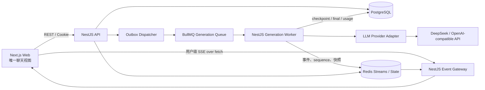
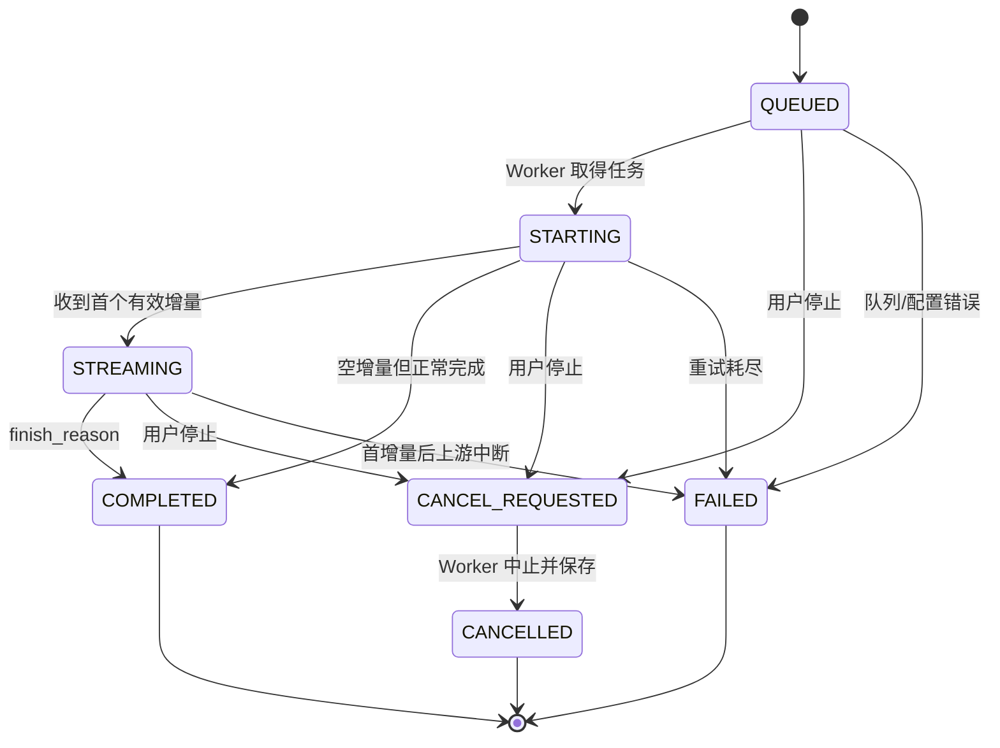
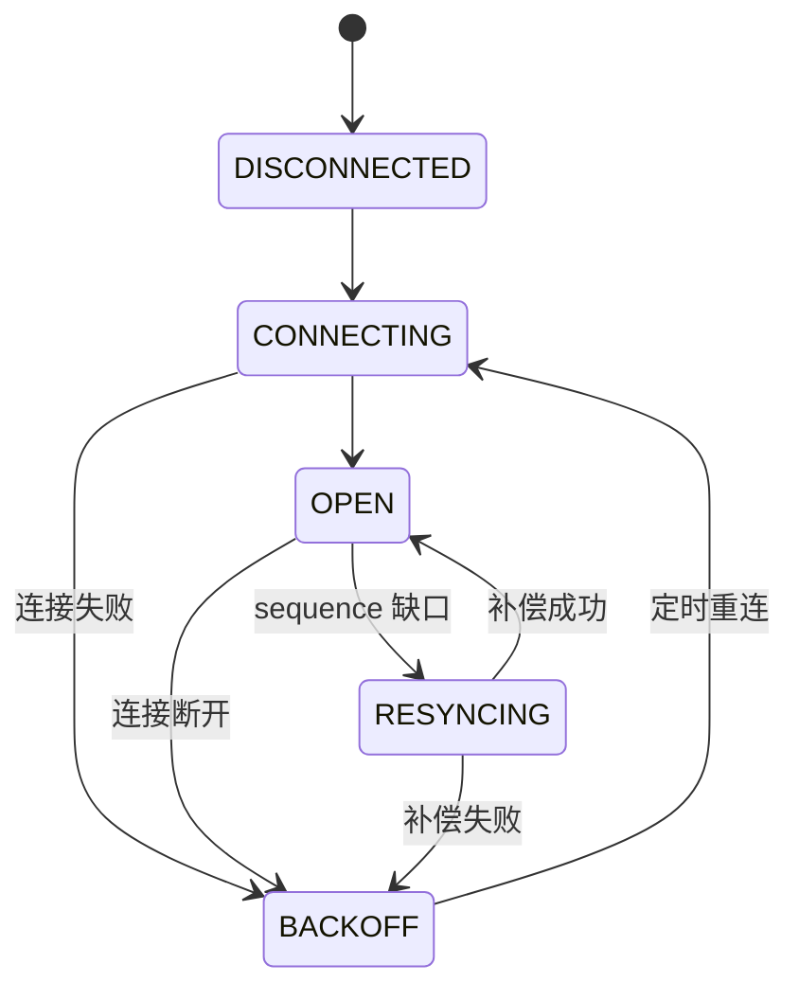
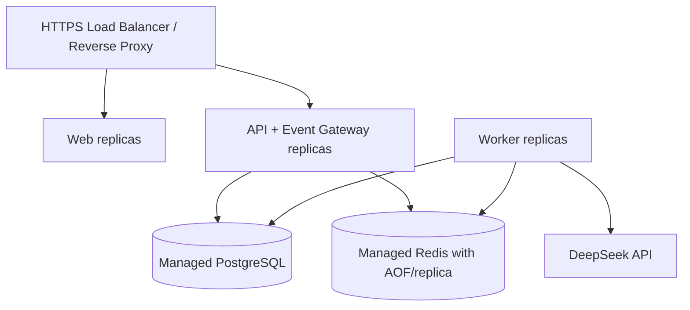
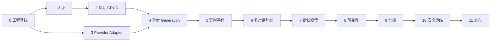

# 多对话并发流式 AI 聊天系统项目开发文档

> 文档版本：v1.0  
> 编制日期：2026-08-04  
> 文档状态：已确认，可进入实施  
> 参考依据：《ChatGPT 多对话并发流式实现研究》及 OpenAI、DeepSeek、NestJS 官方资料

## 0. 文档目的

本文档用于指导一个独立的类 ChatGPT Web 应用从零设计、开发、测试到部署。它不是概念性研究报告，而是后续可以逐阶段执行的工程蓝图。

本文档明确：

- 第一版产品范围与暂不实现的能力；
- 前端、API、异步 Worker、数据库、Redis 和模型供应商之间的职责边界；
- 多对话并发、后台持续生成、流式事件分发和断线恢复的完整协议；
- 核心数据表、Redis 数据结构、状态机和 API 契约；
- 分阶段实现顺序、每一阶段的测试项和验收门槛；
- 安全、限流、重试、可观测性、部署与故障恢复要求。

后续编码以本文档为基线。如实施过程中需要改变关键架构，应先新增 ADR（Architecture Decision Record），说明原因、替代方案、迁移影响和验证方法，再修改实现。

---

## 1. 已确认的项目决策

| 决策项               | 已确认方案                                                         |
| -------------------- | ------------------------------------------------------------------ |
| 产品形态             | 独立的类 ChatGPT Web 应用                                          |
| 私有接口             | 不调用、不逆向 ChatGPT Web 私有接口                                |
| 模型协议             | 以 OpenAI-compatible Chat Completions 协议作为第一版供应商接口基线 |
| 首个模型供应商       | DeepSeek，模型名、Base URL 和密钥全部通过配置注入                  |
| 前端                 | Next.js + React + TypeScript                                       |
| 后端                 | NestJS + TypeScript                                                |
| 关系数据库           | PostgreSQL                                                         |
| 缓存、队列与事件日志 | Redis + BullMQ + Redis Streams                                     |
| 前端流式通道         | SSE over `fetch()`；单个用户级连接，多 generation 复用             |
| 断线恢复             | 事件序号重放 + 稳定快照回退                                        |
| 多用户               | 第一版即建立用户认证、数据隔离、并发限制和基础安全能力             |
| 第一版暂不包含       | 支付、团队空间、文件上传、联网搜索、模型工具调用和多模态输入       |

### 1.1 为什么第一版采用 Chat Completions 兼容层

DeepSeek 官方接口支持 OpenAI 风格的 `/chat/completions`、`messages` 和流式 SSE 数据格式，因此第一版采用该协议能降低供应商接入成本。业务层不得直接依赖 DeepSeek 专有字段，而是通过 `LlmProviderAdapter` 适配。未来接入 OpenAI Responses API、其他 OpenAI-compatible 服务或本地推理服务时，不需要重写会话与流式系统。

### 1.2 关于 DeepSeek 当前模型名

截至本文档日期，DeepSeek 官方文档列出的主模型为 `deepseek-v4-flash` 和 `deepseek-v4-pro`，旧的 `deepseek-chat`、`deepseek-reasoner` 已到官方公告的弃用日期。因此：

- 示例环境默认使用 `deepseek-v4-flash`；
- 代码中不得写死任何模型名；
- 模型能力、上下文长度和最大输出必须来自配置或模型注册表；
- 上线前重新核对供应商官方模型页，避免依赖已过期别名。

官方依据：[DeepSeek 首次 API 调用](https://api-docs.deepseek.com/)、[模型与价格](https://api-docs.deepseek.com/quick_start/pricing)。

---

## 2. 产品目标与范围

### 2.1 核心目标

用户能够同时在多个对话中发起长输出任务，并获得以下体验：

1. 对话 A 生成过程中切换到对话 B，A 不被取消；
2. 在 B 中发起另一任务后，A、B 可独立并发；
3. 页面一次只渲染当前对话，后台对话继续接收和保存增量；
4. 切回 A 时立即恢复其最新文本和生成状态；
5. 刷新页面或短时断网后，从已确认的事件序号继续；
6. 新标签页能读取活动 generation 的状态、快照和最终结果；
7. generation 完成、失败或取消时，所有在线标签最终收敛到一致状态；
8. 服务端最终结果是权威数据，浏览器缓存不是唯一数据来源。

### 2.2 第一版功能范围

#### 用户与安全

- 邮箱和密码注册、登录、刷新会话与退出；
- 安全的 HttpOnly Cookie；
- 用户之间的对话、消息和 generation 强隔离；
- 用户级、IP 级和供应商级限流；
- 基础审计和安全日志。

#### 对话

- 新建、查看、重命名、归档、恢复和永久删除对话；
- 对话列表分页和最近活动排序；
- 单条线性消息链；
- Markdown、代码块和复制；
- 停止生成、重新生成失败回答；
- 生成完成后的未读标识。

#### 模型生成

- OpenAI-compatible Chat Completions；
- DeepSeek 适配器；
- 文本增量与可选的 `reasoning_content` 增量；
- 多 generation 并发；
- 供应商错误映射、有限重试和用量记录；
- 配置化模型选择。

#### 恢复与一致性

- 幂等消息提交；
- 每个 generation 单调递增的 `sequence`；
- 用户级 SSE 多路复用；
- 重复事件去重、缺口检测和按序补偿；
- Redis Stream 保留期内精确重放；
- 重放数据过期时使用完整快照替换；
- 最终消息强制持久化到 PostgreSQL。

### 2.3 第一版非目标

下列能力不阻塞第一版上线，并应避免在核心并发流式链路稳定前加入：

- 支付和套餐；
- 团队、组织、共享对话；
- 文件、图片、音频和视频输入；
- 联网搜索、RAG 和知识库；
- Function Calling、MCP 和外部工具执行；
- 对话分支、多人实时协作；
- 原生移动端；
- 供应商自动故障切换。

适配器和数据结构可以为这些能力预留扩展点，但不得提前实现未验证的抽象。

---

## 3. 核心验收场景

以下场景是项目最终验收的主线，任何一个失败都不能认为项目已完成。

### 场景 A：同一 SPA 内两个对话并发

1. 用户在对话 A 发起至少持续 20 秒的生成；
2. 生成过程中切到 B，并发起另一生成；
3. 在 A、B 间连续切换至少 5 次；
4. 两个任务都不得因路由切换取消；
5. 每个对话的内容、状态和停止按钮必须对应正确 generation；
6. 最终刷新页面后，两份完整回答均能从服务端恢复。

### 场景 B：生成中刷新

1. 回答已经产生至少 100 个事件；
2. 记录浏览器最后应用的事件游标与 generation sequence；
3. 整页刷新；
4. 客户端加载稳定快照并恢复事件连接；
5. 内容不得重复、乱序或丢失；
6. generation 最终状态和数据库一致。

### 场景 C：断网与事件缺口

1. 人为断开事件连接 5～15 秒，但不停止 Worker；
2. 恢复网络；
3. 客户端携带最后游标重连；
4. Redis 保留期内必须精确补齐事件；
5. 注入一个 sequence 缺口时，客户端必须进入 `resyncing`，禁止继续盲目追加；
6. 补偿完成后自动回到 `streaming`。

### 场景 D：独立标签页

1. 标签页一正在生成；
2. 标签页二打开同一正式对话 URL；
3. 标签页二能获取 generation 状态和快照；
4. 两个标签最终显示相同完成内容；
5. 任一标签停止任务后，另一标签收到取消状态。

### 场景 E：幂等与故障

1. 同一个 `Idempotency-Key` 连续提交两次；
2. 数据库只能产生一个用户消息和一个 generation；
3. Worker 在首个模型 delta 前遇到 429/503 时按策略有限重试；
4. 首个 delta 后发生连接失败时保留部分内容并明确标记失败，不自动偷偷重生成；
5. 用户手动重试时创建新的 generation，不覆盖旧的失败记录。

---

## 4. 总体架构



### 4.1 组件职责

| 组件              | 主要职责                                                     | 明确不负责                               |
| ----------------- | ------------------------------------------------------------ | ---------------------------------------- |
| Next.js Web       | 路由、交互、单一聊天视图、前端分桶 Store、事件去重和恢复     | 不持有模型密钥，不决定最终事实           |
| NestJS API        | 认证、授权、CRUD、幂等提交、快照读取、取消请求               | 不在 HTTP 请求生命周期中直接跑长模型任务 |
| Event Gateway     | 用户级事件连接、历史重放、心跳、背压和断开清理               | 不执行模型推理                           |
| BullMQ            | 可靠排队、Worker 调度、并发控制、首 token 前重试             | 不作为最终消息数据库                     |
| Generation Worker | 上下文组装、模型流消费、事件归一化、checkpoint、最终提交     | 不依赖浏览器是否在线                     |
| Redis Streams     | 短期可重放事件日志和活动 generation 状态                     | 不作为永久聊天历史                       |
| PostgreSQL        | 用户、会话、消息、generation、最终内容、用量和审计的权威数据 | 不为每个上游 token 执行一次事务          |
| Provider Adapter  | 隔离供应商请求、流格式和错误差异                             | 不包含产品会话状态逻辑                   |

### 4.2 关键设计原则

1. **generation 与页面生命周期解耦**：路由切换或组件卸载不得触发取消。
2. **单一权威写入路径**：Worker 是 assistant 流式内容的唯一写者。
3. **先持久化任务，再异步执行**：提交 API 返回 `202 Accepted`，不等待模型完成。
4. **事件至少一次传递，客户端幂等归并**：允许重复，不允许重复显示。
5. **事件日志短期可靠，最终消息长期可靠**：Redis 负责恢复窗口，PostgreSQL 负责永久事实。
6. **快照可以替代一段 delta**：过期或缺口恢复时使用 `replace` 语义，不将快照当增量追加。
7. **供应商失败不伪装成成功**：保留部分回答、错误分类和重试记录。
8. **后台对话不执行昂贵渲染**：只更新数据，切回后再渲染 Markdown。

---

## 5. 技术栈与版本策略

### 5.1 推荐栈

| 层            | 技术                                         |
| ------------- | -------------------------------------------- |
| Monorepo      | pnpm workspaces + Turborepo                  |
| Web           | Next.js、React、TypeScript                   |
| 前端数据      | TanStack Query + Zustand                     |
| UI            | Tailwind CSS；组件库在实施阶段确定           |
| API / Worker  | NestJS，分别构建为独立进程                   |
| ORM           | Prisma                                       |
| 数据库        | PostgreSQL                                   |
| 队列          | BullMQ                                       |
| 缓存与事件    | Redis Streams、Hash、Set、Lua 脚本           |
| LLM SDK       | OpenAI JavaScript SDK，通过自有 Adapter 封装 |
| 校验          | Zod（共享协议）+ Nest ValidationPipe         |
| 日志          | Pino 结构化日志                              |
| 追踪          | OpenTelemetry                                |
| 单元/集成测试 | Vitest 或 Jest；项目初始化时只选一种         |
| E2E           | Playwright                                   |
| 负载测试      | k6                                           |
| 本地环境      | Docker Compose                               |

### 5.2 版本策略

- 初始化项目时选择当日稳定主版本并生成 lockfile；
- 生产环境固定 Node.js LTS 的精确大版本；
- Docker 镜像使用明确 tag，不使用 `latest`；
- 依赖升级由自动化 PR 发起，必须通过单元、集成和 E2E；
- 本文档不硬编码未来可能过期的框架次版本或模型别名。

### 5.3 为什么使用 SSE 而不是 WebSocket

第一版数据方向主要是服务端向浏览器推送，用户操作继续使用 REST。SSE 天然支持事件 ID、文本事件、HTTP 基础设施和重连语义；NestJS 也提供正式 SSE 支持。浏览器侧采用 `fetch()` 读取 SSE，而不是原生 `EventSource`，以便显式携带 Cookie、游标、AbortSignal 和自定义恢复逻辑。

SSE 只负责本系统的内部事件协议；DeepSeek 上游的 data-only SSE 由 Provider Adapter 消费并转换，不能原样透传给浏览器。NestJS SSE 格式参考：[NestJS Server-Sent Events](https://docs.nestjs.com/techniques/server-sent-events)。

---

## 6. Monorepo 结构

```text
apps/
  web/                         # Next.js
  api/                         # NestJS REST + Event Gateway
  worker/                      # NestJS BullMQ Worker
packages/
  contracts/                   # Zod schema、DTO、事件和错误码
  database/                    # Prisma schema、migration、seed
  config/                      # 环境变量 schema 与共享配置
  llm/                         # Provider 接口和 OpenAI-compatible Adapter
  observability/               # 日志、metrics、trace
  test-utils/                  # fake provider、fixtures、测试容器辅助
infra/
  docker/
  compose/
  nginx-or-caddy/
docs/
  adr/
  api/
  runbooks/
```

### 6.1 边界规则

- `apps/web` 只能通过 `packages/contracts` 使用服务端协议，不直接导入 ORM 类型；
- `apps/api` 不导入具体 DeepSeek 实现，只依赖 `LlmProviderRegistry` 的查询能力；
- `apps/worker` 是唯一可以发起模型生成请求的应用；
- `packages/llm` 不导入 Prisma，不知道用户、对话页面或未读状态；
- `packages/contracts` 不依赖任何应用层实现；
- API 和 Worker 共享数据库与 Redis，但拥有独立进程、健康检查和扩容策略。

---

## 7. 核心领域模型

### 7.1 主要实体

| 实体                  | 说明                                           |
| --------------------- | ---------------------------------------------- |
| User                  | 产品用户                                       |
| RefreshSession        | 可撤销、可轮换的登录会话                       |
| Conversation          | 一个用户拥有的对话                             |
| ConversationUserState | 已读位置和用户侧对话状态                       |
| Message               | 用户、助手或系统消息的永久记录                 |
| Generation            | 一次针对 assistant message 的生成任务          |
| GenerationAttempt     | 上游调用尝试，记录供应商请求与错误             |
| UsageRecord           | 一次成功或可计量调用的 token 用量              |
| OutboxEvent           | 数据库事务完成后等待投递到队列或事件系统的记录 |
| AuditLog              | 登录、安全和关键操作日志                       |

### 7.2 PostgreSQL 表设计

#### `users`

| 字段          | 类型/约束      | 说明                |
| ------------- | -------------- | ------------------- |
| id            | UUID, PK       | 内部用户 ID         |
| email         | CITEXT, UNIQUE | 规范化邮箱          |
| password_hash | TEXT           | Argon2id 哈希       |
| status        | ENUM           | `ACTIVE / DISABLED` |
| created_at    | TIMESTAMPTZ    | 创建时间            |
| updated_at    | TIMESTAMPTZ    | 更新时间            |

#### `refresh_sessions`

| 字段            | 类型/约束         | 说明                      |
| --------------- | ----------------- | ------------------------- |
| id              | UUID, PK          | 会话 ID                   |
| user_id         | UUID, FK          | 所属用户                  |
| token_hash      | TEXT, UNIQUE      | 仅保存 refresh token 哈希 |
| user_agent_hash | TEXT, NULL        | 安全审计，不存完整敏感值  |
| expires_at      | TIMESTAMPTZ       | 过期时间                  |
| revoked_at      | TIMESTAMPTZ, NULL | 撤销时间                  |
| rotated_from_id | UUID, NULL        | 轮换链路                  |

#### `conversations`

| 字段            | 类型/约束    | 说明                                           |
| --------------- | ------------ | ---------------------------------------------- |
| id              | UUID, PK     | 正式 conversation ID                           |
| user_id         | UUID, FK     | 所属用户                                       |
| title           | VARCHAR(200) | 标题                                           |
| status          | ENUM         | `ACTIVE / ARCHIVED`                            |
| default_model   | VARCHAR(100) | 创建时模型配置                                 |
| revision        | BIGINT       | 每次对话投影变化时递增，用于跨标签去除迟到事件 |
| created_at      | TIMESTAMPTZ  | 创建时间                                       |
| updated_at      | TIMESTAMPTZ  | 更新时间                                       |
| last_message_at | TIMESTAMPTZ  | 列表排序                                       |

索引：`(user_id, status, last_message_at DESC, id DESC)`。

#### `conversation_user_states`

| 字段                 | 类型/约束         | 说明                               |
| -------------------- | ----------------- | ---------------------------------- |
| conversation_id      | UUID, PK/FK       | 对话                               |
| user_id              | UUID, FK          | 当前版本等于 owner，为团队能力预留 |
| last_read_message_id | UUID, NULL        | 最后已读消息                       |
| last_read_at         | TIMESTAMPTZ, NULL | 已读时间                           |
| has_unread           | BOOLEAN           | 快速列表查询                       |

#### `messages`

| 字段              | 类型/约束         | 说明                                                   |
| ----------------- | ----------------- | ------------------------------------------------------ |
| id                | UUID, PK          | 消息 ID                                                |
| conversation_id   | UUID, FK          | 所属对话                                               |
| role              | ENUM              | `SYSTEM / USER / ASSISTANT`                            |
| status            | ENUM              | `PENDING / STREAMING / COMPLETED / FAILED / CANCELLED` |
| content           | TEXT              | 最终或最近 checkpoint 内容                             |
| reasoning_content | TEXT, NULL        | 供应商显式返回的推理内容；可配置不保存                 |
| parent_message_id | UUID, NULL        | 预留再生成链路，第一版仍为线性展示                     |
| created_at        | TIMESTAMPTZ       | 创建时间                                               |
| updated_at        | TIMESTAMPTZ       | 更新时间                                               |
| completed_at      | TIMESTAMPTZ, NULL | 完成时间                                               |

索引：`(conversation_id, created_at, id)`。应用层和数据库约束共同保证同一 conversation 的归属检查。

#### `generations`

| 字段                | 类型/约束          | 说明                         |
| ------------------- | ------------------ | ---------------------------- |
| id                  | UUID, PK           | generation ID                |
| user_id             | UUID, FK           | 冗余归属，用于快速授权和分区 |
| conversation_id     | UUID, FK           | 所属对话                     |
| request_message_id  | UUID, FK           | 触发生成的用户消息           |
| response_message_id | UUID, UNIQUE FK    | assistant 占位消息           |
| provider            | VARCHAR(50)        | 如 `deepseek`                |
| model               | VARCHAR(100)       | 实际请求模型                 |
| status              | ENUM               | generation 状态机            |
| last_sequence       | BIGINT             | 已发布的最大业务序号         |
| checkpoint_sequence | BIGINT             | PostgreSQL 内容对应的序号    |
| idempotency_key     | VARCHAR(100)       | 用户提交幂等键               |
| request_hash        | CHAR(64)           | 同键不同请求检测             |
| finish_reason       | VARCHAR(50), NULL  | 供应商完成原因               |
| provider_request_id | TEXT, NULL         | 上游请求追踪                 |
| error_code          | VARCHAR(100), NULL | 归一化错误码                 |
| error_detail_safe   | TEXT, NULL         | 可向用户或运维展示的脱敏信息 |
| cancel_requested_at | TIMESTAMPTZ, NULL  | 取消请求时间                 |
| started_at          | TIMESTAMPTZ, NULL  | 开始时间                     |
| first_token_at      | TIMESTAMPTZ, NULL  | 首增量时间                   |
| completed_at        | TIMESTAMPTZ, NULL  | 终态时间                     |
| created_at          | TIMESTAMPTZ        | 创建时间                     |
| updated_at          | TIMESTAMPTZ        | 更新时间                     |

唯一索引：`(user_id, idempotency_key)`。活动任务索引：`(user_id, status, created_at)`。

#### `generation_attempts`

记录每次 Worker 调用尝试：`generation_id`、`attempt_no`、`status`、`provider_request_id`、`started_at`、`ended_at`、`received_first_delta`、`http_status`、`error_code`。唯一约束为 `(generation_id, attempt_no)`。

#### `usage_records`

记录 `prompt_tokens`、`completion_tokens`、`reasoning_tokens`、`cache_hit_tokens`、`cache_miss_tokens`、供应商、模型和时间。未知字段允许为空，不用 `0` 假装供应商返回了数据。

#### `outbox_events`

| 字段                          | 说明                     |
| ----------------------------- | ------------------------ |
| id                            | UUID，事件 ID            |
| aggregate_type / aggregate_id | 如 `generation / gen_x`  |
| type                          | 如 `generation.enqueue`  |
| payload                       | JSONB                    |
| created_at                    | 事务时间                 |
| published_at                  | 成功投递时间，未投递为空 |
| attempts / last_error         | 投递重试信息             |

提交用户消息、assistant 占位、generation 和 `generation.enqueue` outbox 必须在同一个 PostgreSQL 事务中完成。

---

## 8. Redis 与队列设计

### 8.1 Redis Key 规范

```text
queue:generation                                  # BullMQ 内部键空间使用独立 prefix
chat:evt:{userId}:user                            # 用户级多路复用事件流
chat:evt:{userId}:gen:{generationId}              # generation 级精确重放事件流
chat:evt:{userId}:gen:{generationId}:seq          # generation 业务 sequence
chat:evt:{userId}:gen:{generationId}:state        # 活动状态、完整快照和最后 sequence
chat:evt:{userId}:active                          # 活动 generation 集合
chat:evt:{userId}:gen:{generationId}:cancel       # 取消标记，短 TTL
chat:evt:{userId}:generation-limit                # 用户并发计数/信号量
```

所有环境必须使用命名空间前缀，例如 `chat:prod:`，避免测试、预发和生产互相污染。`{userId}` 是 Redis Cluster hash tag，使同一用户的 generation sequence、state、generation Stream 和 user Stream 位于同一 slot，从而允许 Lua 原子发布。

### 8.2 `chat:evt:{userId}:gen:{generationId}:state` 建议字段

```json
{
  "status": "STREAMING",
  "conversation_id": "uuid",
  "message_id": "uuid",
  "last_sequence": "128",
  "content": "当前完整文本",
  "reasoning_content": "当前完整推理文本",
  "updated_at_ms": "1785812400000",
  "worker_heartbeat_ms": "1785812400000"
}
```

活动 generation 的 Redis 快照是恢复加速层。最终事实仍以 PostgreSQL 为准。

### 8.3 用户级 Redis Stream

每个 generation 事件同时写入用户级 Stream 和对应 generation Stream。用户流用于单连接实时多路复用；generation 流用于 `after_sequence` 精确补偿，避免扫描该用户的全部事件。字段至少包含：

```json
{
  "event_version": "1",
  "event_id": "uuid",
  "generation_id": "uuid",
  "conversation_id": "uuid",
  "message_id": "uuid",
  "sequence": "128",
  "type": "message.delta",
  "occurred_at": "2026-08-04T10:00:00.000Z",
  "payload": "{...json...}"
}
```

用户 Stream 使用 Redis 自动 ID，作为用户通道的全局游标；generation Stream 使用 `<sequence>-0` 作为 ID。`sequence` 是单个 generation 内的业务顺序，两种游标不能混用。

### 8.4 原子发布

使用 Lua 脚本完成以下原子操作：

1. `INCR chat:evt:{userId}:gen:{generationId}:seq`；
2. 更新 `chat:evt:{userId}:gen:{generationId}:state`；
3. `XADD chat:evt:{userId}:gen:{generationId} <sequence>-0`；
4. `XADD chat:evt:{userId}:user *`；
5. 返回 generation sequence、generation Stream ID 和用户 Stream ID。

这样避免“状态已经更新但事件未写入”或“事件序号重复”。单个 generation 同时只允许一个持有 BullMQ 锁的 Worker 写入。

### 8.5 保留策略

- 活动 generation 事件不得裁剪；
- 用户 Stream 和 generation Stream 的终态事件默认保留 24 小时，具体值可配置；
- 使用按时间的 `XTRIM MINID` 或后台清理任务，不只依赖近似条数；
- generation state 在终态后至少保留 24 小时；
- Redis 生产环境启用 AOF，并配置内存告警；
- 超出精确重放窗口时，通过 PostgreSQL/Redis 完整快照恢复，不承诺逐 delta 重放。

### 8.6 BullMQ 策略

- Job ID 使用 `generationId`，防止重复入队；
- 每个 generation 只对应一个逻辑 Job；
- Worker 并发由全局配置控制；
- 单用户活动 generation 默认上限建议为 3；
- 排队任务可以取消；
- 首个模型 delta 前，网络错误、429、500、503 可指数退避并加入随机抖动；
- 首个 delta 后禁止自动从头重试，避免重复文本和重复计费；
- 死信任务保留 generation 与 attempt 记录，不能静默删除。

NestJS 官方将队列用于削峰、隔离长任务和跨进程可靠通信，这与本项目 Worker 模式一致：[NestJS Queues](https://docs.nestjs.com/techniques/queues)。

---

## 9. 状态机

### 9.1 Generation 状态机



终态 `COMPLETED / FAILED / CANCELLED` 不允许回退。重新生成创建新 generation 和新 assistant message，不复用旧任务。

### 9.2 前端连接状态机



连接状态与 generation 状态严格分离。SSE 断开不表示 generation 失败；用户离开对话也不表示 generation 取消。

### 9.3 Message 状态

- 用户消息在数据库事务成功后直接为 `COMPLETED`；
- assistant 占位消息随 generation 依次为 `PENDING → STREAMING → COMPLETED/FAILED/CANCELLED`；
- `FAILED` 或 `CANCELLED` 消息允许保留非空部分内容；
- 最终状态事件到达后，前端必须以服务端终态为准。

---

## 10. 内部事件协议

### 10.1 用户事件 Envelope

```ts
type BaseUserEvent<TType extends string, TPayload> = {
  version: 1;
  eventId: string;
  streamId: string; // 用户 Redis Stream 游标
  type: TType;
  userId: string; // 仅服务端内部使用，发给客户端时可省略
  conversationId: string;
  occurredAt: string;
  payload: TPayload;
};

type GenerationEvent<TPayload> = BaseUserEvent<
  GenerationEventType,
  TPayload
> & {
  generationId: string;
  messageId: string;
  sequence: number; // generation 内从 1 单调递增
};

type ConversationEvent<TPayload> = BaseUserEvent<
  'conversation.updated',
  TPayload
> & {
  revision: number; // conversation 投影版本，用于去除迟到更新
};

type UserStreamEvent = GenerationEvent<unknown> | ConversationEvent<unknown>;
```

Redis 自动生成用户 Stream ID 后，由 Event Gateway 将其填入发往浏览器的 `streamId`。generation 事件按 `sequence` 归并；普通 conversation 事件按 `revision` 归并。

### 10.2 第一版事件类型

| 事件                      | payload                                           | 客户端动作                        |
| ------------------------- | ------------------------------------------------- | --------------------------------- |
| `generation.queued`       | `model`                                           | 设置排队状态                      |
| `generation.started`      | `attempt`                                         | 设置开始状态                      |
| `message.reasoning_delta` | `delta`                                           | 追加到 reasoning buffer           |
| `message.delta`           | `delta`                                           | 追加到正文 buffer                 |
| `message.snapshot`        | `content`, `reasoningContent`, `snapshotSequence` | 完整替换，不追加                  |
| `generation.usage`        | token 字段                                        | 更新用量                          |
| `generation.completed`    | `finishReason`, `finalContentHash`                | 设置完成并触发 REST 校验/缓存更新 |
| `generation.failed`       | `code`, `retryable`, `safeMessage`                | 保留部分文本并显示失败            |
| `generation.cancelled`    | `partial`                                         | 设置取消                          |
| `conversation.updated`    | `revision`, `title`, `hasUnread`, `lastMessageAt` | 按 revision 更新侧边栏投影        |

### 10.3 Delta 合并

上游每个 token 不直接变成一条本系统事件。Worker 将 token 暂存，并在满足任一条件时发布批次：

- 距上次发布 20～50ms；
- 缓冲达到 256～512 字符；
- 收到 finish、error 或 cancel；
- reasoning 与正文通道发生切换。

实际阈值在性能测试后固定。目的不是人为延迟，而是降低 Redis、网络、React 更新和 Markdown 解析压力。

### 10.4 客户端 Reducer 规则

对于每个 generation 维护 `lastAppliedSequence`：

```text
event.sequence <= lastAppliedSequence
  → 重复事件，忽略

event.sequence == lastAppliedSequence + 1
  → 正常应用

event.sequence > lastAppliedSequence + 1
  → 发现缺口，暂停该 generation 的追加，进入 resync

message.snapshot
  → 用完整内容 replace，并将 lastAppliedSequence 更新为 snapshotSequence
```

事件处理必须是纯函数并有单元测试。不得通过“收到什么就 append 什么”实现。

`conversation.updated` 不参与 generation sequence；客户端记录每个 conversation 的最新 `revision`，忽略 revision 更旧或相同的迟到事件。

---

## 11. 断线续传与同步算法

### 11.1 正常重连

1. 浏览器在内存和 `sessionStorage` 保存最后确认的用户 Stream ID；
2. SSE 断开后按指数退避重连：1s、2s、4s、8s，最大 15s，并加入抖动；
3. 请求 `GET /api/v1/events?after=<streamId>`；
4. Event Gateway 使用 `XREAD` 先重放，再阻塞等待新事件；
5. 客户端根据 generation sequence 去重；
6. 每收到一批已成功归并的事件，再更新本地游标。

### 11.2 页面首次加载与刷新

为避免“先取快照还是先连事件”的竞态，执行以下顺序：

1. 拉取当前对话历史；
2. 调用 `GET /api/v1/sync`，获取活动 generation 快照和 `eventCursor`；
3. 将快照写入 Zustand；
4. 打开 `GET /api/v1/events?after=<eventCursor>`；
5. 对历史、快照和后续事件统一按 `sequence` 去重；
6. 如果在步骤 1～4 之间 generation 已完成，`sync` 或后续事件至少有一条路径能提供终态；
7. SSE 打开后再对活动 generation 做一次轻量状态校验，用于覆盖极端竞态。

`/sync` 的游标与 Redis 活动快照应由同一服务方法读取；必要时使用 Lua 获取一致的 `state + stream tail id`。

### 11.3 单 generation 补偿

当发现缺口时请求。服务端直接读取该 generation 的短期 Redis Stream，无需扫描用户级 Stream：

```http
GET /api/v1/generations/{generationId}/events?after_sequence=87
```

服务端返回两种结果之一：

#### 精确事件

```json
{
  "mode": "events",
  "events": [],
  "lastSequence": 120
}
```

#### 快照回退

```json
{
  "mode": "snapshot",
  "snapshot": {
    "content": "完整内容",
    "reasoningContent": null,
    "sequence": 120,
    "status": "STREAMING"
  }
}
```

若请求序号早于 Redis 保留范围，服务端必须返回快照，不能返回一个看似成功但缺事件的数组。

### 11.4 恢复保证

- 活动 generation 及终态后 24 小时内：目标为精确事件重放；
- 超出事件保留期：保证恢复最新完整快照或最终消息，不保证逐 delta 重现；
- Worker 崩溃导致上游连接丢失：无法从模型供应商的上游 token 位置继续，本系统将任务标记失败并保留已确认部分；
- 用户手动重试是新 generation，不宣称“继续原模型请求”。

该边界必须在产品文案和运维手册中保持一致。

---

## 12. API 契约

所有接口前缀为 `/api/v1`。请求与响应使用 `packages/contracts` 中的 Zod schema 生成或校验。错误响应统一包含 `code`、`message`、`requestId`，不得直接返回内部堆栈。

### 12.1 认证

```text
POST   /auth/register
POST   /auth/login
POST   /auth/refresh
POST   /auth/logout
GET    /auth/me
```

### 12.2 对话

```text
POST   /conversations
GET    /conversations?cursor=&limit=
GET    /conversations/{conversationId}
PATCH  /conversations/{conversationId}
POST   /conversations/{conversationId}/archive
POST   /conversations/{conversationId}/restore
DELETE /conversations/{conversationId}       # 永久删除已归档且无活动生成任务的对话
POST   /conversations/{conversationId}/read
GET    /conversations/{conversationId}/messages?cursor=&limit=
```

### 12.3 创建 generation

```http
POST /api/v1/conversations/{conversationId}/generations
Idempotency-Key: 4b7...
Content-Type: application/json
```

```json
{
  "content": "请解释 Redis Streams",
  "clientMessageId": "uuid"
}
```

Generation 使用 API 进程从 `LLM_DEFAULT_MODEL` 读取的模型，客户端不得覆盖。

返回 `202 Accepted`：

```json
{
  "conversation": { "id": "uuid" },
  "userMessage": {
    "id": "uuid",
    "role": "USER",
    "content": "请解释 Redis Streams",
    "status": "COMPLETED"
  },
  "assistantMessage": {
    "id": "uuid",
    "role": "ASSISTANT",
    "content": "",
    "status": "PENDING"
  },
  "generation": {
    "id": "uuid",
    "status": "QUEUED",
    "lastSequence": 0
  }
}
```

同一 `Idempotency-Key` 和相同请求体重复提交时返回原结果；同一 key 对应不同 `request_hash` 时返回 `409 IDEMPOTENCY_KEY_REUSED`。

新对话首条消息可以先 `POST /conversations` 获取正式 ID，再创建 generation。第一版不必实现临时 ID 到正式 ID 映射，以减少关键链路复杂度；前端可以在请求完成前展示本地乐观壳层。

### 12.4 Generation

```text
GET    /generations/{generationId}
GET    /generations/{generationId}/events?after_sequence=
POST   /generations/{generationId}/cancel
POST   /generations/{generationId}/retry
GET    /sync
```

`cancel` 只设置 `CANCEL_REQUESTED` 和 Redis 取消信号，由 Worker 负责 Abort 上游、flush 缓冲、checkpoint 和发布终态。若任务已是终态，重复取消返回当前状态，保持幂等。

`retry` 仅对 `FAILED` 或 `CANCELLED` 开放，创建新的 assistant message 和 generation，并在 `parent_message_id` 中记录来源。

### 12.5 用户级 SSE

```http
GET /api/v1/events?after=1785812400000-0
Accept: text/event-stream
```

响应示例：

```text
id: 1785812400123-0
event: message.delta
data: {"version":1,"conversationId":"...","generationId":"...","messageId":"...","sequence":12,"payload":{"delta":"你好"}}

: heartbeat 1785812415

```

要求：

- 心跳间隔 15～25 秒；
- 设置 `Cache-Control: no-cache, no-transform`；
- 反向代理关闭响应缓冲；
- 服务端检测断开并释放阻塞读取；
- 单用户单标签只建立一个事件连接；
- 连接不得因当前对话路由变化而重建。

### 12.6 HTTP 错误码

| 业务码                        | HTTP | 含义                                   |
| ----------------------------- | ---: | -------------------------------------- |
| `UNAUTHENTICATED`             |  401 | 未登录或会话过期                       |
| `FORBIDDEN`                   |  403 | 无权访问资源                           |
| `NOT_FOUND`                   |  404 | 资源不存在，跨用户查询也返回此码防枚举 |
| `VALIDATION_ERROR`            |  422 | 参数不合法                             |
| `IDEMPOTENCY_KEY_REUSED`      |  409 | 同 key 不同请求                        |
| `GENERATION_ALREADY_TERMINAL` |  409 | 对终态执行非法操作                     |
| `USER_CONCURRENCY_LIMIT`      |  429 | 用户并发达到上限                       |
| `PROVIDER_RATE_LIMITED`       |  503 | 供应商限流，经过内部映射               |
| `PROVIDER_UNAVAILABLE`        |  503 | 供应商暂不可用                         |
| `EVENT_CURSOR_EXPIRED`        |  409 | 用户通道游标过期，应执行 `/sync`       |

---

## 13. 前端设计

### 13.1 状态职责划分

为避免 REST 快照和流式增量互相覆盖，采用明确的双层状态模型：

| 状态           | 所有者                    | 示例                                          |
| -------------- | ------------------------- | --------------------------------------------- |
| 稳定服务端数据 | TanStack Query            | 对话列表、分页历史、最终消息                  |
| 活动流状态     | Zustand `GenerationStore` | delta buffer、status、sequence、stream cursor |
| 连接生命周期   | `GenerationManager`       | connect、backoff、resync、abort               |
| 当前投影       | React selector            | 稳定消息与活动覆盖层合并后的当前对话          |

`GenerationStore` 不复制完整历史，只保存活动 generation 的覆盖层：

```ts
type ActiveGenerationState = {
  generationId: string;
  conversationId: string;
  messageId: string;
  status: GenerationStatus;
  content: string;
  reasoningContent?: string;
  lastAppliedSequence: number;
  syncState: 'synced' | 'resyncing';
  error?: SafeGenerationError;
};
```

### 13.2 `GenerationManager`

`GenerationManager` 挂载在应用根布局下，生命周期长于任何聊天页面。职责包括：

- 登录后建立一个用户级 SSE 连接；
- 解析 SSE frame，将事件按 generation 分桶；
- 维护 Stream ID 和重连退避；
- 批量提交事件到 Zustand；
- 发现 sequence 缺口时触发单 generation 补偿；
- 页面隐藏时继续连接，但可降低非关键 UI 刷新频率；
- 退出登录时断开连接并清空用户数据；
- 不因为 route change 取消 generation。

禁止以下模式：

```tsx
useEffect(() => {
  const controller = startGeneration(conversationId);
  return () => controller.abort(); // 路由卸载会错误取消后台任务
}, [conversationId]);
```

### 13.3 单一聊天视图

页面只渲染当前 `conversationId`：

```tsx
function ChatPage({ conversationId }: { conversationId: string }) {
  const stableMessages = useConversationMessages(conversationId);
  const overlays = useGenerationStore(selectByConversation(conversationId));
  const messages = mergeStableAndStreaming(stableMessages, overlays);

  return <MessageList messages={messages} />;
}
```

后台对话收到事件时只修改 Store，不挂载第二份 Markdown DOM。侧边栏只订阅轻量字段：状态、未读、标题和最后活动时间。

### 13.4 渲染性能

- 网络事件先进入缓冲区，每 16～50ms 批量更新 Store；
- 当前对话正文可按 `requestAnimationFrame` 更新；
- Markdown 解析节流到约 80～150ms，生成完成后执行一次最终解析；
- 长对话使用消息级虚拟化，代码块内部谨慎虚拟化；
- 后台对话禁止 Markdown、高亮、公式排版和滚动测量；
- Store selector 必须精确，避免任一 generation 更新导致整个侧边栏重渲染；
- 对回答尾部使用增量展示，但数据库快照仍保存完整字符串。

### 13.5 滚动规则

- 用户位于底部阈值内时自动跟随；
- 用户主动上滚后停止自动滚动并显示“回到底部”；
- 切换对话时分别保存滚动位置；
- `message.snapshot` 替换内容后不得强制抢夺用户滚动；
- generation 结束时仅在用户仍处于跟随状态时滚到底部。

### 13.6 跨标签

每个标签建立自己的用户级 SSE 连接，所有连接消费同一 Redis Stream 但不使用 consumer group，因为每个标签都需要完整副本。可选使用 `BroadcastChannel` 降低重复 REST 拉取，但它只能作为优化，不能作为正确性依赖。

### 13.7 Markdown 安全

- 默认禁止原始 HTML；
- 使用严格白名单 sanitizer；
- 链接添加安全属性，外链明确标识；
- 代码块按文本渲染，不执行其中脚本；
- 复制功能读取原始文本，不读取潜在的 DOM 注入；
- 对超长无空格内容设置换行和布局上限。

---

## 14. NestJS API 设计

### 14.1 模块划分

```text
AppModule
├── AuthModule
├── UsersModule
├── ConversationsModule
├── MessagesModule
├── GenerationsModule
├── EventsModule
├── SyncModule
├── IdempotencyModule
├── OutboxModule
├── RateLimitModule
├── HealthModule
└── ObservabilityModule
```

### 14.2 提交事务

创建 generation 的服务方法必须：

1. 验证用户拥有 conversation；
2. 规范化请求并计算 `request_hash`；
3. 查询 `(user_id, idempotency_key)`；
4. 若已存在且 hash 相同，返回原资源；
5. 若 key 已存在但 hash 不同，返回 409；
6. 在一个事务内创建 user message；
7. 创建 assistant placeholder；
8. 创建 generation；
9. 更新 conversation 的 `last_message_at`；
10. 创建 `generation.enqueue` outbox；
11. 提交后立即返回 202；
12. Outbox Dispatcher 异步将 generation 投递 BullMQ。

API 请求中不得直接等待 DeepSeek 首 token，因为这会使客户端断开、网关超时和任务生命周期耦合。

### 14.3 授权规则

所有 conversation、message 和 generation 查询必须同时包含 `user_id` 条件，不允许先按资源 ID 查询再在内存中判断。示例：

```ts
await prisma.generation.findFirst({
  where: { id: generationId, userId: currentUser.id },
});
```

跨用户资源统一返回 404，防止 ID 枚举。

### 14.4 Outbox Dispatcher

- 使用数据库行锁或 `FOR UPDATE SKIP LOCKED` 领取未发布事件；
- BullMQ Job ID 固定为 generation ID；
- 入队成功后写 `published_at`；
- 入队成功但数据库确认失败时，下一轮重复投递会被 Job ID 去重；
- outbox 积压量纳入告警；
- 不使用“事务提交后直接 `queue.add()` 且失败不记录”的双写模式。

### 14.5 Event Gateway

Event Gateway 先验证用户，再读取该用户自己的 Stream。实现时可使用 NestJS 原生响应流或 `@Sse()` + RxJS，但必须验证：

- 能使用客户端 `after` 游标执行历史 `XREAD`；
- 断开后能取消 Redis 阻塞读取；
- 不因 RxJS unsubscribe 意外取消 generation；
- 能输出自定义 `id`、`event`、`data` 和心跳注释；
- 能处理慢客户端和最大缓冲限制。

若 `@Sse()` 难以满足精细游标和背压控制，可以在 NestJS Controller 中使用受测试覆盖的原生 `Response` 流。框架装饰器不是架构要求，SSE 协议正确性才是。

---

## 15. Generation Worker 设计

### 15.1 Worker 主流程

```text
领取 BullMQ Job
  → 校验 generation 仍为 QUEUED
  → 获取用户/全局并发许可
  → 状态改为 STARTING
  → 加载并裁剪上下文
  → 创建 generation_attempt
  → 调用 Provider Adapter
  → 消费 reasoning/content/usage/finish 事件
  → 批量发布内部事件与更新 Redis 完整快照
  → 周期性写 PostgreSQL checkpoint
  → 收到完成/取消/错误
  → flush 所有缓冲
  → 强制持久化最终消息、usage 和 generation 终态
  → 发布终态事件与未读更新
  → 释放并发许可
```

所有退出路径都必须执行许可释放和缓冲 flush，使用 `try/finally` 与可测试的终结器实现。

### 15.2 Checkpoint 策略

满足任一条件时写 PostgreSQL checkpoint：

- 距上次 checkpoint 超过 500～1000ms；
- 新增正文超过 2～4KB；
- 状态发生关键变化；
- 收到取消、错误或完成。

Checkpoint 更新必须带版本条件：只允许新的 `checkpoint_sequence` 覆盖旧值。最终提交在事务内更新 message、generation、usage、conversation unread/outbox。

### 15.3 Worker 心跳与僵尸检测

- 活动 Worker 每 5～10 秒更新 Redis heartbeat；
- 监控任务发现 heartbeat 超时且 BullMQ Job 不再活动时，将 generation 标记为 `FAILED/WORKER_LOST`；
- 不得在旧 Worker 仍可能写入时直接启动第二个 Writer；
- 应先确认 BullMQ 锁失效和 attempt 状态，再进行终结；
- 恢复动作保留 partial content。

### 15.4 上下文组装

第一版按时间顺序读取已完成的 `SYSTEM / USER / ASSISTANT` 消息，排除：

- 当前 assistant 占位消息；
- 未终结的其他 generation 内容；
- 失败或取消消息的部分内容，除非用户明确选择保留；
- 供应商不要求回传的历史 reasoning 内容。

模型注册表至少定义：

```ts
type ModelProfile = {
  provider: string;
  model: string;
  contextWindow: number;
  maxOutputTokens: number;
  supportsReasoning: boolean;
  supportsUsageInStream: boolean;
};
```

上下文预算：

```text
system + history + current user + reserved output <= context window
```

超出预算时，第一版按消息边界从最旧普通消息开始裁剪，保留 system 和最近轮次，并在日志/指标中记录裁剪。自动摘要属于后续增强，不在核心第一版静默启用。

---

## 16. LLM Provider 抽象与 DeepSeek 适配

### 16.1 接口

```ts
interface LlmProviderAdapter {
  streamChat(
    request: NormalizedChatRequest,
    signal: AbortSignal,
  ): AsyncIterable<NormalizedLlmEvent>;
}

type NormalizedLlmEvent =
  | { type: 'reasoning_delta'; delta: string }
  | { type: 'content_delta'; delta: string }
  | { type: 'usage'; usage: NormalizedUsage }
  | { type: 'finish'; finishReason: string; providerRequestId?: string };
```

供应商 HTTP 状态、SDK 异常和 SSE 解析错误统一映射为：

```ts
type ProviderError = {
  code:
    | 'AUTHENTICATION_FAILED'
    | 'INSUFFICIENT_BALANCE'
    | 'INVALID_REQUEST'
    | 'RATE_LIMITED'
    | 'OVERLOADED'
    | 'TIMEOUT'
    | 'CONNECTION_LOST'
    | 'MALFORMED_STREAM'
    | 'UNKNOWN';
  retryableBeforeFirstDelta: boolean;
  httpStatus?: number;
  safeMessage: string;
};
```

### 16.2 DeepSeek 配置

```dotenv
LLM_PROVIDER=deepseek
LLM_BASE_URL=https://api.deepseek.com
LLM_API_KEY=replace_me
LLM_DEFAULT_MODEL=deepseek-v4-flash
LLM_REASONING_MODE=enabled
LLM_REASONING_EFFORT=high
LLM_REQUEST_TIMEOUT_MS=600000
LLM_MAX_OUTPUT_TOKENS=8192
```

密钥只存在服务端 Secret 管理系统和 Worker 环境，不进入 Next.js public env、浏览器 bundle、日志或数据库。

### 16.3 DeepSeek 流处理要求

DeepSeek Chat Completions 在 `stream: true` 时返回 data-only SSE，并以 `data: [DONE]` 结束；`stream_options.include_usage` 可在结束前返回用量块。Adapter 必须：

- 忽略 `: keep-alive` SSE 注释；
- 容忍空行；
- 分别解析 `delta.reasoning_content` 和 `delta.content`；
- 读取 `finish_reason`；
- 处理 choices 为空但包含 usage 的块；
- 对未知可选字段保持向前兼容；
- 不把 `[DONE]` 作为 JSON 解析；
- 在 AbortSignal 触发时关闭上游请求。

官方协议参考：[DeepSeek Chat Completions API](https://api-docs.deepseek.com/api/create-chat-completion)。

### 16.4 Thinking Mode

DeepSeek 当前文档说明 thinking 默认启用，并通过 `reasoning_content` 返回。第一版支持将其作为独立通道显示在可折叠区域。配置为 disabled 时，Adapter 不发送 thinking 参数以外的无效采样参数。

多轮普通聊天不依赖历史 reasoning 内容；如果未来加入 thinking 模式 Tool Calls，DeepSeek 要求将相应 `reasoning_content` 完整传回。由于第一版不做工具调用，此要求只记录为未来扩展约束。参考：[DeepSeek Thinking Mode](https://api-docs.deepseek.com/guides/thinking_mode)。

### 16.5 用户隔离标识

向 DeepSeek 发送 `user_id` 时使用稳定、不可逆、无 PII 的值，例如：

```text
base64url(HMAC-SHA256(serverSecret, internalUserId))
```

不得发送邮箱、手机号或明文内部 ID。DeepSeek 官方说明 `user_id` 可用于内容安全、KV Cache 和调度隔离，并要求不包含隐私信息：[Rate Limit & Isolation](https://api-docs.deepseek.com/quick_start/rate_limit)。

### 16.6 供应商错误与重试

DeepSeek 官方列出的 400/401/402/422 属于不可重试或需人工修复；429/500/503 在首 delta 前可以短暂重试。参考：[DeepSeek Error Codes](https://api-docs.deepseek.com/quick_start/error_codes/)。

建议策略：

| 错误       | 首 delta 前          | 首 delta 后        |
| ---------- | -------------------- | ------------------ |
| 400 / 422  | 立即失败             | 立即失败           |
| 401 / 402  | 立即失败并告警       | 立即失败并告警     |
| 429        | 最多 2～3 次指数退避 | 保留部分内容并失败 |
| 500 / 503  | 最多 2～3 次指数退避 | 保留部分内容并失败 |
| 超时/断连  | 若尚无 delta 可重试  | 不自动从头生成     |
| 客户端取消 | 不重试               | Abort 并标记取消   |

---

## 17. 一致性、并发与边界条件

### 17.1 事实优先级

```text
PostgreSQL 最终消息/终态
  > Redis 活动快照
  > 浏览器内存覆盖层
  > 本地乐观 UI
```

这不表示每次 delta 都查 PostgreSQL，而是冲突解决时遵循该顺序。

### 17.2 单 Writer

同一 generation 只允许一个 Worker 发布事件。BullMQ Job lock、固定 Job ID 和 attempt 记录共同约束。若发生锁丢失，旧 Worker 必须停止发布；Redis Lua 可选校验 `writer_token`，防止僵尸 Worker 写入。

### 17.3 幂等性

以下操作必须幂等：

- 创建 generation；
- outbox 投递 BullMQ；
- 应用流事件；
- 取消 generation；
- 最终状态持久化；
- 对话已读更新。

幂等不等于吞掉冲突。同 key 不同请求必须显式报错。

### 17.4 完成竞态

用户在任务恰好完成时点击停止：

- 数据库终态写入使用条件更新；
- 若 `COMPLETED` 先提交，取消返回当前完成状态；
- 若 `CANCEL_REQUESTED` 先提交，Worker 在下一安全点取消；
- 任何情况下不能同时出现两个终态事件；
- 前端对重复终态按 sequence 去重。

### 17.5 标题生成

第一版避免额外 LLM 并发：默认使用首条用户消息截断生成标题。后续可新增低优先级标题 generation，但不得占用用户主 generation 的并发额度。

### 17.6 未读规则

- generation 在非当前可见对话完成时设置 `has_unread=true`；
- 当前标签可见且对话处于激活状态时提交 read receipt；
- 多标签任一标签读取后，其他标签通过 `conversation.updated` 收敛；
- 未读是服务端状态，不能只保存在浏览器。

---

## 18. 认证与安全

### 18.1 会话策略

- 密码使用 Argon2id；
- 短期 access token 与轮换 refresh token；
- token 存 Secure、HttpOnly、SameSite Cookie；
- 数据库只存 refresh token 哈希；
- 退出和密码变更可撤销会话；
- Cookie 认证的写接口必须有 CSRF 防护；
- 生产环境 Web 与 API 使用同站域名或明确受控 CORS。

### 18.2 输入限制

- 用户消息字符数和估算 token 数上限；
- 标题长度、分页 limit、游标格式和 UUID 严格校验；
- `Idempotency-Key` 长度及字符集限制；
- SSE `after` 和 `after_sequence` 必须解析为合法游标/整数；
- 请求体大小在反向代理和 NestJS 两层限制；
- 禁止用户覆盖 provider Base URL 或注入任意请求头。

### 18.3 限流

至少包含：

- 登录与注册 IP 限流；
- REST 用户级速率限制；
- 单用户活动 generation 上限；
- 全局 Worker 并发上限；
- 单供应商/模型并发上限；
- SSE 每用户最大标签连接数；
- 消息长度和每日 token 软/硬限额。

供应商账户限制不能直接当作产品用户限额。内部限额必须显著低于供应商上限，并能配置调整。

### 18.4 隐私与日志

- 默认不记录用户 prompt、完整回答、Cookie 或 API Key；
- 日志记录 ID、长度、状态、耗时、token 数和错误分类；
- 必要的内容调试通过受控开关、脱敏、最短保留期和审计完成；
- `user_id` 发送给供应商前使用 HMAC；
- 明确隐私政策、数据保留和删除流程后再公开上线。

### 18.5 威胁模型重点

- 越权读取其他用户对话；
- SSE 游标被用于读取其他用户事件；
- Markdown XSS；
- refresh token 重放；
- 幂等键碰撞和请求重放；
- 恶意用户耗尽模型余额或 Worker 并发；
- 日志泄漏模型密钥或用户内容；
- Redis Key 注入；
- 慢 SSE 客户端导致内存积压。

---

## 19. 可观测性与 SLO

### 19.1 关联 ID

每条链路至少包含：

- `request_id`；
- `trace_id`；
- `user_id_hash`；
- `conversation_id`；
- `generation_id`；
- `attempt_no`；
- `provider_request_id`；
- `stream_id` 和 `sequence`（事件日志）。

### 19.2 核心指标

#### API

- 请求量、p50/p95/p99、错误率；
- generation 提交耗时；
- idempotency 命中和冲突；
- SSE 在线连接数、连接时长、重连率。

#### Queue / Worker

- 队列深度和等待时间；
- 活动、完成、失败、取消任务数；
- Worker 并发使用率；
- outbox 未投递数量和最老年龄；
- 首 delta 前重试次数；
- Worker heartbeat 超时。

#### 流式体验

- queue wait；
- time to first provider byte；
- time to first visible token；
- 内部 event publish latency；
- 事件 gap、duplicate、resync 次数；
- checkpoint 延迟和最终持久化延迟；
- reconnect to synced 耗时。

#### 供应商与成本

- 按 provider/model/status 的请求数；
- 429、5xx、超时和断连；
- prompt/completion/reasoning/cache token；
- 单用户和全局 token 消耗；
- finish reason 分布。

### 19.3 首版 SLO

| 指标                         | 目标                                   |
| ---------------------------- | -------------------------------------- |
| generation 创建 API p95      | `< 300ms`，不含模型排队和推理          |
| 应用内部事件转发 p95         | `< 200ms`，不含供应商 token 生成       |
| 有效游标重连后恢复 p95       | `< 2s`                                 |
| SPA 已缓存对话切换到可见 p95 | `< 200ms`                              |
| 最终消息持久化               | 终态事件前或同一终结流程内完成，不丢失 |
| 重复显示                     | 0                                      |
| 跨用户数据泄漏               | 0                                      |

供应商 TTFT 单独统计，不把上游延迟伪装成应用自身 SLO。

### 19.4 告警

- outbox 最老未发布事件超过 60 秒；
- queue wait p95 超过阈值；
- generation 失败率突增；
- DeepSeek 401/402 出现一次即高优告警；
- 429/503 持续升高；
- Redis 内存、连接数、AOF 或复制异常；
- PostgreSQL 连接池耗尽或 checkpoint 延迟；
- 活动 generation heartbeat 超时；
- SSE 重连或 resync 比率异常。

---

## 20. 测试策略

### 20.1 测试金字塔

| 层级     | 内容                                                                 |
| -------- | -------------------------------------------------------------------- |
| 单元     | 状态机、事件 reducer、SSE parser、Provider error mapping、上下文裁剪 |
| 契约     | Zod DTO、API 响应、DeepSeek fixture、事件版本兼容                    |
| 集成     | PostgreSQL 事务、outbox、BullMQ、Redis Lua、Stream 重放              |
| E2E      | 浏览器多对话、刷新、断网、跨标签、取消、登录隔离                     |
| 故障注入 | Worker 崩溃、Redis 重启、供应商 429/503、事件重复/缺口               |
| 负载     | 多用户并发 generation、SSE 长连接、Redis/Worker 背压                 |

### 20.2 Fake LLM Provider

在 `packages/test-utils` 实现可脚本化的 Fake Provider，支持：

- 固定间隔输出 N 个 delta；
- 分离 reasoning 和 content；
- 首 delta 前抛 429/503；
- 第 K 个 delta 后断开；
- 延迟首 token；
- 返回空内容、usage-only chunk、未知字段；
- 响应 AbortSignal；
- 产生可预测的内容 hash。

核心测试不得依赖真实 DeepSeek 额度、网络和非确定性输出。

### 20.3 必须覆盖的单元测试

- sequence 正常、重复、乱序和缺口；
- snapshot replace 语义；
- completed 后迟到 delta 被拒绝；
- cancel/completed 竞态；
- 同幂等 key 同请求和不同请求；
- SSE frame 跨 chunk 切割；
- `[DONE]`、空行和 `: keep-alive`；
- usage chunk 的空 choices；
- checkpoint 旧 sequence 不能覆盖新内容；
- DeepSeek 错误到内部错误码映射。

### 20.4 Playwright E2E

至少包括：

1. 两个对话同时流式生成；
2. 连续切换不取消；
3. 后台完成后侧边栏未读；
4. 生成中刷新并恢复；
5. 事件连接断开后重连；
6. 强制丢一个事件后补偿；
7. 两个浏览器 Context 模拟两个标签；
8. 从任一标签取消；
9. 两个用户无法访问彼此资源和 Stream；
10. 失败后手动重试产生新 generation。

### 20.5 负载基线

首轮建议验证：

- 100 个并发用户；
- 每用户 1 个 SSE；
- 其中 30～50 个用户各有 2～3 个并发 generation；
- Fake Provider 以可控频率输出；
- 运行至少 15 分钟；
- 观察 API 延迟、Event Gateway 内存、Redis ops、队列深度和事件延迟。

负载目标应在实际部署资源确定后重新校准，不能把此基线误作无限扩容承诺。

---

## 21. 本地与生产部署

### 21.1 本地 Docker Compose

```text
postgres
redis
web
api
worker
```

开发模式可在宿主机运行 web/api/worker，只用 Compose 启动 PostgreSQL 和 Redis。所有服务通过 `.env.example` 提供变量说明，不提交真实密钥。

### 21.2 生产拓扑



### 21.3 反向代理要求

- SSE 路由关闭 proxy buffering；
- 关闭响应转换和压缩缓冲，或验证压缩不会攒包；
- idle timeout 大于心跳间隔；
- HTTP/2 可用；
- 单连接和单 IP 限制适配正常多标签；
- 滚动发布时允许旧连接优雅排空；
- `X-Accel-Buffering: no` 等配置需通过实际时间戳测试验证。

### 21.4 数据可靠性

- PostgreSQL 自动备份和时间点恢复；
- Redis 启用 AOF，必要时使用副本；
- 定期演练 PostgreSQL 恢复；
- Redis 丢失时允许活动 generation 失败，但最终已完成消息不得丢失；
- 部署前执行 migration，采用向后兼容的 expand/contract 策略；
- 不在同一发布中先删除旧字段再滚动 API/Worker。

### 21.5 健康检查

```text
GET /health/live       # 进程存活，不查外部依赖
GET /health/ready      # PostgreSQL、Redis 和必要配置可用
GET /health/startup    # migration/初始化完成
```

DeepSeek 临时不可用不应让 API 实例退出负载均衡，但应影响 generation readiness 指标和用户提示。

---

## 22. 分阶段开发计划

实施必须按阶段推进。每阶段先补测试，再完成验收；未通过验收时不开始依赖该能力的下一阶段。阶段编号同时作为后续 Codex 实施任务的主索引。

### 阶段 0：工程基线与 ADR

**目标**：建立可重复开发环境，冻结关键边界。

**实施任务**：

1. 初始化 pnpm + Turborepo monorepo；
2. 创建 `web`、`api`、`worker` 和共享 packages；
3. 统一 TypeScript、ESLint、Prettier、测试和构建配置；
4. 建立 `.env.example` 与 Zod 环境变量校验；
5. 创建 Docker Compose 的 PostgreSQL、Redis；
6. 创建 CI：lint、typecheck、unit test、build；
7. 编写首批 ADR：
   - ADR-001：Chat Completions compatible provider layer；
   - ADR-002：PostgreSQL + Redis Streams + BullMQ；
   - ADR-003：用户级 SSE 多路复用；
   - ADR-004：短期事件重放 + 长期快照；
8. 创建 `AGENTS.md`，记录项目命令、目录边界、测试和安全规则。

**交付物**：可启动的空应用、基础设施、CI、ADR。

**测试**：全新环境执行一次安装、启动、lint、typecheck、test、build。

**验收门槛**：

- 一条命令启动 PostgreSQL 与 Redis；
- web/api/worker 均有 health 或占位启动输出；
- CI 从空缓存通过；
- 无真实密钥进入 Git。

### 阶段 1：数据库、认证与用户隔离

**目标**：建立多用户安全基础。

**实施任务**：

1. 编写 Prisma schema 与初始 migration；
2. 实现 User、RefreshSession、AuditLog；
3. 实现注册、登录、刷新、退出和 `/me`；
4. Argon2id 密码哈希；
5. HttpOnly Cookie、refresh rotation 和 CSRF；
6. API 全局 ValidationPipe、错误格式和 request ID；
7. 实现认证/IP 限流；
8. 集成测试 token 轮换、撤销和跨用户访问。

**交付物**：可注册登录的空产品。

**测试**：认证单元测试、数据库集成测试、Cookie/CSRF E2E。

**验收门槛**：

- 用户能注册、登录、刷新、退出；
- refresh token 只以哈希存储；
- 被撤销会话不能恢复；
- 用户 A 无法读取用户 B 的任何受保护占位资源；
- 日志不出现密码或 token。

### 阶段 2：对话与消息 CRUD

**目标**：在不接模型的情况下完成稳定聊天数据层和 UI 骨架。

**实施任务**：

1. 实现 Conversation、ConversationUserState、Message；
2. 对话创建、列表、详情、重命名、归档、已读；
3. 消息游标分页；
4. Next.js 登录页、主布局、侧边栏、聊天页和输入框；
5. TanStack Query 缓存键和失效策略；
6. Markdown 安全渲染；
7. 对话级滚动位置；
8. 用静态 assistant 消息测试长列表。

**交付物**：无模型生成但完整可操作的聊天壳层。

**测试**：CRUD 集成测试、越权测试、分页稳定性、Markdown XSS E2E。

**验收门槛**：

- 刷新后对话和消息保持；
- 分页无重复、无遗漏；
- 归档对话不出现在默认列表；
- 原始 HTML 或脚本无法执行；
- 两个用户的数据完全隔离。

### 阶段 3：Provider Adapter 与单任务流

**目标**：完成供应商隔离和可测试的上游流解析，暂不引入后台并发架构。

**实施任务**：

1. 定义 `NormalizedChatRequest/Event/Error`；
2. 实现 Fake Provider；
3. 实现 OpenAI-compatible Adapter；
4. DeepSeek Base URL、模型、reasoning 和 usage 配置；
5. 解析 SSE chunk、keep-alive、`[DONE]`、reasoning/content/usage；
6. AbortSignal 和超时；
7. 编写官方样例与异常流 fixtures；
8. 创建一个仅开发环境使用的 Worker 流解析测试入口。

**交付物**：不依赖业务页面也可验证的模型适配包。

**测试**：Adapter 契约测试和 Fake Provider 单元测试；真实 DeepSeek 冒烟测试由显式环境开关启用。

**验收门槛**：

- Fake Provider 所有脚本场景通过；
- DeepSeek 文本、reasoning、usage 和完成原因被正确归一化；
- keep-alive 不触发解析错误；
- 取消能关闭上游流；
- API Key 不进入日志和前端 bundle。

### 阶段 4：异步 Generation 与最终持久化

**目标**：generation 脱离 API 请求和页面生命周期运行。

**实施任务**：

1. 创建 Generation、GenerationAttempt、UsageRecord、OutboxEvent；
2. 实现幂等 generation 创建事务；
3. Outbox Dispatcher 投递 BullMQ；
4. Worker 加载上下文并调用 Fake Provider；
5. 状态机和条件更新；
6. assistant placeholder 与最终消息持久化；
7. 首 delta 前重试、首 delta 后失败；
8. 任务取消标记和 Abort；
9. 基础 generation 查询接口。

**交付物**：使用轮询也能看到 generation 从 queued 到终态的后台系统。

**测试**：事务、outbox 重投、Job ID 去重、Worker 状态机、重试和取消集成测试。

**验收门槛**：

- 创建接口在模型完成前返回 202；
- API 进程重启不丢已提交任务；
- 路由关闭不取消任务；
- 同 Idempotency-Key 只产生一个 generation；
- Worker 完成后 PostgreSQL 有完整最终消息；
- 首 delta 后断连保留部分内容且标记失败。

### 阶段 5：事件发布、SSE 与实时单对话

**目标**：打通 Worker → Redis → Event Gateway → 浏览器的实时链路。

**实施任务**：

1. 实现 Redis Key namespace；
2. 编写 sequence + state + XADD Lua 脚本；
3. Worker delta 批处理；
4. 用户级 Event Gateway；
5. SSE 心跳、历史读取和断开清理；
6. 前端 SSE-over-fetch parser；
7. `GenerationStore` 与纯 reducer；
8. 当前对话流式 UI；
9. 完成后合并/失效 TanStack Query。

**交付物**：单对话端到端流式生成。

**测试**：Lua 原子性、SSE frame 切割、重复/顺序事件、单浏览器 E2E。

**验收门槛**：

- 文本持续显示且无重复；
- reasoning 和 content 正确分区；
- 刷新前最终结果已写 PostgreSQL；
- 连接关闭不会取消 Worker；
- 事件从 Worker 发布到浏览器的应用层延迟达到目标。

### 阶段 6：多对话 GenerationManager

**目标**：实现项目最核心的 SPA 多对话并发体验。

**实施任务**：

1. 将 `GenerationManager` 移到根布局；
2. 单用户 SSE 事件按 conversation/generation 分桶；
3. Store 精细 selector；
4. 后台对话只更新状态；
5. 单一聊天视图合并稳定消息和流式覆盖层；
6. 侧边栏生成状态和未读；
7. 每个对话独立滚动位置；
8. 用户并发 generation 限制与排队提示；
9. 多任务停止按钮的目标校验。

**交付物**：同一 SPA 中至少两个对话稳定并发。

**测试**：核心场景 A 的 Playwright E2E，运行至少 20 次捕捉竞态。

**验收门槛**：

- A/B 同时生成并各自完整；
- 路由切换不建立额外用户事件连接；
- 路由切换不触发 generation cancel；
- 当前页面只渲染一个聊天主区域；
- 后台更新不会导致昂贵 Markdown 重渲染；
- 停止 A 不影响 B。

### 阶段 7：Checkpoint、断线续传与跨标签

**目标**：完成 production-grade 恢复语义。

**实施任务**：

1. Worker Redis 完整快照；
2. PostgreSQL 周期 checkpoint；
3. `/sync`；
4. 用户 Stream ID 持久和重连；
5. `after_sequence` 精确补偿；
6. 事件过期时 snapshot fallback；
7. 客户端 gap 检测与 `resyncing`；
8. 多标签状态收敛；
9. Redis Stream 时间保留和清理任务；
10. 反向代理 SSE 无缓冲验证。

**交付物**：刷新、断网和新标签均能恢复活动 generation。

**测试**：核心场景 B、C、D；事件重复、缺口、过期游标和快照替换。

**验收门槛**：

- 有效游标恢复无重复、无遗漏；
- 缺口发生后客户端暂停追加并成功补偿；
- 过期事件通过快照恢复完整内容；
- 两标签最终内容 hash 一致；
- Redis 事件被清理后 PostgreSQL 最终消息仍完整；
- 刷新恢复 p95 达到 SLO。

### 阶段 8：可靠性、限流与故障恢复

**目标**：处理真实生产故障和资源边界。

**实施任务**：

1. 用户、全局、供应商并发信号量；
2. DeepSeek 429/500/503 退避策略；
3. 401/402 高优告警；
4. Worker heartbeat 和僵尸任务检查；
5. writer token 防双写；
6. outbox backlog 恢复；
7. 慢 SSE 客户端背压和连接上限；
8. Redis/PostgreSQL 短暂故障处理；
9. 安全的 partial response；
10. 用户可理解的错误和重试入口。

**交付物**：故障注入下行为可预测的系统。

**测试**：核心场景 E，Worker kill、Redis restart、数据库短断、慢客户端、上游异常。

**验收门槛**：

- 不出现双 Writer 和重复终态；
- 资源许可无泄漏；
- 429/503 不形成无限重试风暴；
- 首 delta 后错误不自动重复计费式重生成；
- 用户能够区分排队、失败、取消和断线；
- 运维能够通过 ID 找到完整 attempt 链路。

### 阶段 9：性能与长对话

**目标**：在真实长输出和长历史下保持可用。

**实施任务**：

1. 消息列表虚拟化；
2. Markdown 节流和完成后最终渲染；
3. Store selector 与 React Profiler 优化；
4. 上下文 token 估算和裁剪；
5. 模型注册表与 max output 限制；
6. PostgreSQL 索引和查询计划；
7. Redis Stream、Hash 和 Lua 性能测试；
8. k6 负载测试；
9. 调整 delta batch、checkpoint 和 heartbeat 参数。

**交付物**：性能报告和冻结后的运行参数。

**测试**：100 并发用户基线、超长消息、1000+ 消息对话、30 分钟长连接。

**验收门槛**：

- 达到第 19.3 节 SLO；
- 浏览器无持续内存增长；
- 后台对话不产生明显渲染开销；
- 数据库关键查询使用预期索引；
- Event Gateway 无不可控缓冲；
- 上下文超限时给出确定性裁剪而不是供应商 422。

### 阶段 10：安全、可观测性与运维

**目标**：具备上线前的安全和运营能力。

**实施任务**：

1. 结构化日志和内容脱敏；
2. OpenTelemetry trace；
3. metrics 和 dashboard；
4. SLO 告警；
5. Markdown XSS、CSRF、越权和速率限制复查；
6. 供应商密钥轮换流程；
7. PostgreSQL 备份恢复演练；
8. Redis 事件丢失 runbook；
9. Worker 僵尸、outbox 积压、供应商故障 runbook；
10. 依赖和容器安全扫描。

**交付物**：监控面板、告警、runbook、安全检查记录。

**测试**：安全 E2E、恢复演练、告警演练、日志敏感信息扫描。

**验收门槛**：

- 关键链路可通过 generation ID 追踪；
- 日志无 API Key、Cookie、密码和默认用户正文；
- 跨用户访问测试全部拒绝；
- 备份可恢复到可验证环境；
- 关键告警能触达；
- 运维手册能指导处理常见故障。

### 阶段 11：生产发布

**目标**：以可回滚方式发布首个稳定版本。

**实施任务**：

1. 准备生产 PostgreSQL、Redis、Secret 和域名；
2. 构建不可变镜像；
3. 执行 migration 与 seed；
4. 部署 web/api/worker；
5. 验证 SSE 代理配置；
6. 运行生产冒烟测试；
7. 小流量/受邀用户发布；
8. 观察 429、TTFT、失败率、成本和恢复指标；
9. 固化回滚步骤；
10. 完成最终验收清单。

**交付物**：生产系统、发布记录、回滚方案。

**验收门槛**：

- 核心场景 A～E 在生产等价环境通过；
- 生产密钥不出现在镜像和前端；
- 数据库备份和恢复点存在；
- SSE 在实际代理下逐事件到达；
- 回滚不破坏已写入数据；
- 观察窗口内无 P0/P1 问题。

---

## 23. 推荐实施节奏与依赖



建议每一阶段形成一个可运行提交或 PR，包含：

- 代码；
- migration（如有）；
- 测试；
- 更新后的 `.env.example`；
- 对应文档/ADR；
- 验收结果。

不得把阶段 4～7 合并成一次“大爆炸”实现。先验证异步任务，再验证事件，再验证多路分桶，最后增加恢复语义，问题定位会清晰得多。

---

## 24. Definition of Done

任一功能只有同时满足以下条件才算完成：

- 行为满足本文档或已批准 ADR；
- DTO 与事件 schema 已定义并验证；
- 正常路径、失败路径和权限路径均有测试；
- 数据库变更有 migration 和回滚/兼容说明；
- 日志不含敏感信息；
- 指标足以发现主要失败；
- 文档和 `.env.example` 已更新；
- lint、typecheck、unit、integration、build 通过；
- 对用户可见的错误具有明确文案和下一步；
- 不留下无负责人、无期限的关键 TODO。

项目级完成还必须满足核心场景 A～E 和生产发布验收。

---

## 25. 风险登记

| 风险                        | 影响                   | 早期信号                 | 缓解措施                                                |
| --------------------------- | ---------------------- | ------------------------ | ------------------------------------------------------- |
| 供应商协议兼容但字段有差异  | 流解析或参数失败       | 422、未知 chunk          | Adapter + fixture + 契约测试，不让业务直接依赖 SDK 类型 |
| DeepSeek 模型名或参数变化   | 上线后请求失败         | 官方 changelog、422      | 配置化模型注册表，上线前官方文档复核                    |
| Redis 事件过早裁剪          | 无法精确重放           | cursor expired 增加      | 活动任务不裁剪、时间保留、快照 fallback、告警           |
| 双 Worker 写同一 generation | 内容重复、乱序         | sequence/attempt 异常    | BullMQ lock、固定 Job ID、writer token                  |
| 每 token 写数据库           | I/O 放大和锁竞争       | DB TPS、checkpoint 延迟  | delta batch + 周期 checkpoint + 最终强制写              |
| SSE 被代理缓冲              | 看似非流式             | 浏览器成批收到文本       | 关闭 buffering、心跳、端到端时间戳测试                  |
| 客户端盲目追加重复事件      | 重复内容               | reconnect 后重复         | sequence reducer 和补偿测试                             |
| 首 delta 后自动重试         | 文本重复和额外计费     | attempt 多次且已有 delta | 首 delta 后只失败，用户显式重试新 generation            |
| 长对话超上下文              | 422 或高成本           | token 估算接近上限       | 模型注册表、预留输出、确定性裁剪                        |
| 后台 Markdown 渲染          | CPU 和内存增长         | React profiler           | 单一聊天 DOM、后台只存数据                              |
| 多标签连接过多              | Event Gateway 资源耗尽 | SSE 连接/用户升高        | 每用户连接限制；BroadcastChannel 仅作优化               |
| 用户滥用模型额度            | 成本失控               | token/用户、并发异常     | 用户限额、速率限制、预算告警                            |
| 日志泄漏内容或密钥          | 严重安全事故           | 日志扫描命中             | 默认不记正文、字段白名单、Secret 管理                   |

---

## 26. 后续扩展路线

核心版本稳定后可按独立 ADR 评估：

1. 自动标题模型任务；
2. 上下文摘要和长期记忆；
3. Function Calling 与工具执行状态机；
4. 文件上传、对象存储和 RAG；
5. OpenAI Responses API 专用 Adapter；
6. 多供应商路由与故障切换；
7. 团队空间和共享对话；
8. 对话分支与编辑后重生成；
9. 计费、套餐和额度；
10. 移动端和推送通知。

这些能力不得复用 `message.delta` 承载完全不同的语义。新增工具调用、多模态或结构化事件时提升事件 schema 的 minor 版本，并保持旧客户端可以忽略未知事件。

---

## 27. 后续与 Codex 的实施方式

后续实现建议按以下方式协作：

1. 用户指定“开始阶段 N”；
2. Codex 先检查当前仓库状态、上一阶段验收和未提交改动；
3. 输出本阶段精简执行计划；
4. 先建立测试或可验证骨架，再实现功能；
5. 在阶段内自主完成安全、可逆的代码修改和验证；
6. 遇到会改变本文档关键决策的情况，先说明证据和影响，再请求确认；
7. 阶段结束时提交：改动摘要、关键文件、测试结果、已知限制和下一阶段入口；
8. 只有本阶段验收门槛全部通过，才标记完成。

建议下一步直接执行：

> **阶段 0：工程基线与 ADR**

阶段 0 不需要 DeepSeek API Key。真实模型密钥到阶段 3 的可选冒烟测试时再配置；在此之前所有自动测试使用 Fake Provider。

---

## 28. 官方参考资料

- [DeepSeek：Your First API Call](https://api-docs.deepseek.com/)
- [DeepSeek：Create Chat Completion](https://api-docs.deepseek.com/api/create-chat-completion)
- [DeepSeek：Models & Pricing](https://api-docs.deepseek.com/quick_start/pricing)
- [DeepSeek：Thinking Mode](https://api-docs.deepseek.com/guides/thinking_mode)
- [DeepSeek：Rate Limit & Isolation](https://api-docs.deepseek.com/quick_start/rate_limit)
- [DeepSeek：Error Codes](https://api-docs.deepseek.com/quick_start/error_codes/)
- [DeepSeek：Context Caching](https://api-docs.deepseek.com/guides/kv_cache)
- [NestJS：Server-Sent Events](https://docs.nestjs.com/techniques/server-sent-events)
- [NestJS：Queues](https://docs.nestjs.com/techniques/queues)
- [OpenAI API：Developer Quickstart](https://platform.openai.com/docs/quickstart/make-your-first-api-request)
- [OpenAI API：Backward Compatibility](https://platform.openai.com/docs/api-reference/backward-compatibility)

---

## 29. 最终结论

本项目的核心不是“在聊天页面里开多个流”，而是建立一个与页面生命周期解耦的 generation 系统：

```text
PostgreSQL 中的任务和消息事实
+ BullMQ 的可靠异步执行
+ Worker 对上游 OpenAI-compatible 流的独占消费
+ Redis Streams 的短期可重放事件
+ 用户级 SSE 的多路复用
+ 浏览器按 conversation/generation 分桶的全局 Store
+ active conversation 驱动的单一聊天视图
+ sequence 去重、缺口补偿和 snapshot 回退
```

该方案复现了参考研究中最重要的用户体验，同时避免依赖 ChatGPT 私有实现。完成阶段 0～7 即具备项目的核心差异化能力；完成阶段 8～11 后，才达到可受控上线的工程完整度。
